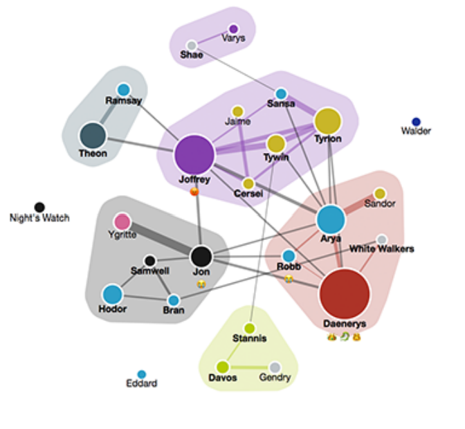
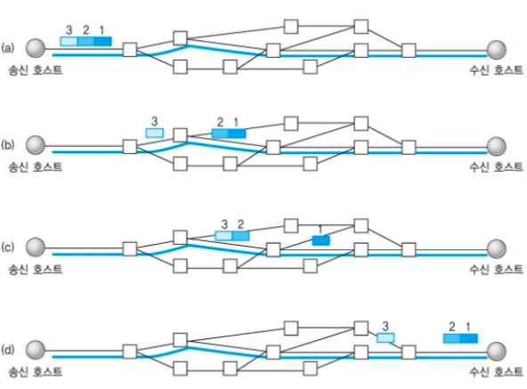
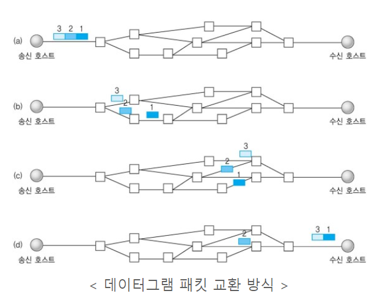

# CS 스터디: 네크워크

### 1. 네트워크란?

노드와 링크가 서로 연결되어 리소스를 공유하는 집합으로, 즉 서로 연결되어 정보를 주고받을 수 있는 통신망이다. 이 모양은 그래프의 형태를 띠고 있다. 다음 그림과 같은 노드와 노드를 연결하는 링크(엣지)로 이루어진 모습이다. 이 때 노드는 정보를 주고 받을 수 있는 장치, 링크는 정보를 주고 받을 수 있는 유무선의 통신 매체이고, 이 노드 간 메시지를 주고 받게 된다. 

ex) 네이버를 접속한다 → www.naver.com을 입력하게 되면 네이버라는 창을 받고 싶다는 요청이 처리가 된다. 이 때 핸드폰의 LAN 카드를 통해 naver 서버와 통신을 하게 된다. 이 때 LAN 카드와 naver 서버가 노드가 되고, 만일 이 때 wifi를 통해 통신했다면 wifi가 엣지가 된다. 

1. 네트워크의 기본 구조

   - 호스트 :  네트워크의 가장 자리에 위치한 노드는 네트워크를 통해 흐르는 정보를 최초로 생성 및 송신하고, 최종적으로 수신한다. 이는 서버 컴퓨터가 될 수도 있고, 개인 데스크톱, 노트북, 스마트폰이 될 수도 있다. 요즘은 더 다양하게 시계, 자동차, 냉장고, TV 등이 될 수도 있다. 우리가 일상에서 사용하는 네트워크 기기 대부분이 여기에 속한다. 이러한 가장자리 노드를 네트워크에서는 호스트 (host)라고 부른다.

     때로는 호스트가 네트워크상에서 특정한 역할을 수행하기도 하는데, 대표적인 역할로는 서버와 클라이언트가 있다. 여기서 서버는 ‘어떠한 서비스’를 제공하는 호스트이다. 여기서 ‘어떠한 서비스’는 파일이 될 수도(파일 서버), 웹 페이지가 될 수도(웹 서버)있다. 이렇듯 무언가를 제공하는 역할을 하는 호스트가 서버이다.

     반면, 클라이언트는 서버에게 어떠한 서비스를 요청하고 서버의 응답을 제공받는 호스트이다. 예를 들어 우리가 노트북에서 웹 브라우저를 열고 구글 웹페이지에 접속을 시도한다면 구글의 서버는 해당 요청을 받고, 그 요청에 맞는 웹 페이지를 웹 브라우저에 전달한다. 여기서 우리의 노트북은 클라이언트로서 구글 서버에 웹 페이지를 요청하고, 그에 대한 응답을 제공받은 셈이다. 

   - 네트워크 장비 : 네트워크 가장자리에 위치하지 않은 노드, 즉 호스트간 주고받을 정보가 중간에 거치는 노드도 있다. 이를 중간 노드라고 한다. 대표적으로 이더넷 허브, 스위치, 라우터, 공유기 등이 있다. 이러한 중간 노드들을 네트워크 장비라 통칭한다. 네트워크 장비는 호스트 간 주고받는 정보가 원하는 수신지까지 안정적이고 안전하게 전송될 수 있도록 한다.

   - 통신 매체 : 그래프는 노드와 이를 연결 짓는 간선(링크)으로 이루어지기에, 호스트와 네트워크 장비 또한 유/무선 매체를 통해 연결되어 있어야 한다. 이렇게 각 노드를 연결하는 간선이 통신 매체이다. 이 통신 매체에는 노드들을 유선으로 연결하는 유선 매체, 무선으로 연결하는 무선 매체가 있다.

   - 메시지 : 통신 매체로 연결된 노드가 주고받는 정보를 메시지라고 한다. 메시지는 웹 페이지가 될 수도, 파일이 될 수도, 메일이 될 수도 있다. 요컨대, 네트워크는 가장자리 노드인 호스트, 중간 노드인 네트워크 장비, 노드들을 연결하는 간선인 통신 매체, 노드들이 주고받는 정보인 메시지로 구성된다.

1. 범위에 따른 네트워크 분류

   - LAN(Local Area Network) : 근거리 통신망(LAN)은 비교적 작은 지역에서 사용되는 네트워크를 의미한다. 일반적으로 한 건물이나 건물의 일부, 또는 한정된 지역 내에서 컴퓨터와 다른 장치를 연결하는 데 사용된다.

     - 범위 : 상대적으로 작음
     - 속도 : 높은 데이터 전송 속도 (보통 1 Gbps 이상)
     - 구성 요소 : 스위치, 라우터, 허브, 이더넷 케이블, Wi-Fi 등
     - 장점 : 속도가 빠르고 네트워크 관리가 비교적 간단하며 보안 관리가 용이함

   - WAN(Wide Area Network) : 광역 네트워크(WAN)는 비교적 먼 거리에 있는 컴퓨터 그룹을 연결하는 대규모 컴퓨터 네트워크이다. WAN은 여러 도시, 국가 또는 대륙을 연결할 수 있다. 대기업에서 사무실 네트워크를 연결하는 데도 자주 사용한다. 각 사무실에는 일반적으로 자체 근거리 통신망(LAN)이 있으며, 이러한 LAN은 WAN을 통해 연결된다. 이러한 긴 연결은 임대 회선, VPN, IP 터널 등 여러 방법으로 형성될 수 있다.

     - 범위: 비교적 넓음. 장거리 통신
     - 일반적으로 LAN보다 낮음(네트워크 규모와 인프라에 따라 다름).
     - 구성 요소 : 라우터, 광섬유, 케이블, 위성 통신, 통신사 네트워크 등.
     - 장점 : 넓은 지역에 걸쳐 네트워크를 구축할 수 있으며, 여러 LAN을 연결하여 통합된 네트워크를 제공
     - VPN : 가상 사설망(VPN)은 사용자가 사설망에 연결된 것처럼 인터넷에 엑세스할 수 있도록 하는 인터넷 보안 서비스이다. 따라서 인터넷 통신을 암호화할 뿐 아니라 강력한 익명성을 제공한다. VPN을 이용하는 가장 일반적인 이유 중 일부는 공용 WIFI에서 스누핑을 방지하거나, 인터넷 검열을 우회하거나, 원격 작업을 위해 기업 내부 네트워크에 연결하는 것이다.
     - IP 터널링 : IP 계층 상에 전용망 환경에서 point-to-point로 연결한 것과 같은 효과를 얻기 위해, 캡슐화 등을 이용하여 두 종단 사이에 가상의 터널을 형성하는 기술. 캡슐화를 통해 정보를 보호하고, 목적지에 도착해서 역캡슐화 진행.

     WAN의 구성 요소에 대한 정의는 상당히 광범위하다. 기술적으로는 넓은 지리적 영역에 걸쳐 분산된 모든 대규모 네트워크가 WAN이다. 인터넷 자체도 WAN으로 간주된다. 

     - 추가 : 왜 LAN의 보안이 더 좋아요? (가볍게 읽어보세용 ..)
       1. 물리적 접근 제어 : LAN은 일반적으로 한정된 지역 내에 설치되므로 네트워크에 물리적으로 접근할 수 있는 사람들을 쉽게 통제할 수 있다. 예를 들어 사무실이나 가정 내에서는 네트워크에 접속할 수 있는 사람들을 알고 있으며, 네트워크 장비가 있는 장소에 대한 접근을 제한할 수 있다. 
       2. 네트워크 관리 용이성 : LAN은 상대적으로 소규모 네트워크이므로 관리가 간편하다. 네트워크 관리자들은 네트워크를 효과적으로 모니터링하고 제어할 수 있으며, 의심스러운 활동을 신속하게 감지하고 대응할 수 있다.
       3. 폐쇄형 네트워크 : LAN은 주로 외부 인터넷과 분리된 폐쇄형 네트워크로 운영될 수 있다. 이는 외부 공격자가 네트워크에 접근할 기회를 최소화한다. 외부 인터넷과 연결될 때는 방화벽 및 기타 보안 장치를 통해 접근을 통제할 수 있다.
       4. 보안 설정과 정책의 적용 : LAN은 네트워크 내의 모든 장치에 대해 통일된 보안 정책을 쉽게 적용할 수 있다. 예를 들어 회사의 LAN에서는 모든 컴퓨터와 장치에 대해 특정 보안 소프트웨어를 설치하고, 정기적으로 업데이트하며, 특정 네트워크 트래픽만 허용하는 규칙을 설정할 수 있다.
       5. 사용자 인증 : LAN 내에서는 사용자를 쉽게 인증하고 권한을 관리할 수 있다. 이는 무단 접근을 방지하는 데 도움이 되며, 각 사용자가 어떤 자원에 접근할 수 있는지를 통제할 수 있다. 

       

     

### 트래픽과 네트워크 성능 지표

- 트래픽(Traffic)

  특정 시점에 링크에 흐르는 데이터의 양.

  단위는 bps(bit per secod)

  - 트래픽이 많다 = 흐르는 데이터가 많다
  - 처리량이 많다 = 처리되는 트래픽이 많다.

  ex) 정보처리기사 신청을 한다고 하자. 이 때 해당 서비스의 용량이 10mb라고 했을 때 10명이 이를 이용하면 10mb*10 = 100mb의 트래픽이 흐른다고 볼 수 있다. 

- 처리량(throughput)

  링크 내에서 성공적으로 전달된 데이터의 양.

  단위는 bps(bit per second)

  - 처리량은 사용자들이 많이 접속할 때마다 커지는 트래픽, 네트워크 장치 간의 대역폭, 에러, 하드웨어 스펙에 영향을 받는다.

  ex) 트래픽은 증가하는데 처리량은 감소하는 경우? 10만명이 동시에 접속하여 트래픽이 늘어났는데 서버가 죽어서 처리량이 낮아지는 것. 

- 대역폭(bandwidth)

  주어진 시간 동안 네트워크 연결을 통해 흐를 수 있는 최대 비트 수

  ex) 도로가 2차선이라면 2대, 4차선이라면 동시에 4대가 지나갈 수 있듯이 대역폭이 크면 동시에 많은 사용자들에게 서비스를 제공할 수 있다.

  → 대략적인 최대 동시 접속자 수 유추의 척도가 된다. 

  
- 패킷 소실

  컴퓨터와 서버 간에 교환 되는 데이터의 손실을 의미한다. 데이터 이동 시간이 단순히 늘어나는 데서 그치지 않고 패킷 손실이 발생할 경우, 일부 패킷은 도착하지 않게 된다. 이러한 경우 패킷을 재전송 해야 하기 때문에 지연이 발생한다. 

  - 패킷(packet)이란? 인터넷 내에서 데이터를 보내기 위한 경로배정(라우팅)을 효율적으로 하기 위해 데이터를 여러 개의 조각들로 나누어 전송을 하는데 이 때, 이 조각을 패킷이라고 한다.

### TCP & UDP

**TCP (Transmission Control Protocol)**

즉 전송을 제어하는 프로토콜(규약)이란 뜻으로 인터넷 상에서 데이터를 메세지의 형태로 보내기 위해 IP와 함께 사용하는 프로토콜이다 .

**IP (Internet Protocol)** 

인터넷 프로토콜입니당 ,,

일반적으로 TCP와 IP를 함께 사용하는데, IP가 데이터의 배달을 처리한다면 TCP는 패킷을 추적 및 관리하게 된다. TCP는 연결형 서비스를 지원하는 프로토콜로 인터넷 환경에서 기본으로 사용한다. (이 말은 UDP는 기본으로 사용되는 프로토콜이 아니라는 뜻이겠죠..?)

- TCP 특징

  - 연결 지향 방식으로 패킷 교환 방식을 사용한다.
  - 3-way handshaking 과정을 통해 연결을 설정하고 4-way handshaking을 통해 해제한다.
  - 흐름 제어 및 혼잡 제어를 해준다.
  - UDP보다 속도가 느리다.
  - 전이중(Full-Duplex), 점대점(Point to Point) 방식이다

  TCP가 연결 지향 방식이란 것은 패킷을 전송하기 위한 논리적 경로를 배정한다는 뜻이다. 그리고 3-way handshaking 과정은 수신지를 확실히 하여 정확한 전송을 보장하기 위해서 세션을 수립하는 과정을 의미한다. 이러한 이유는 TCP는 연결현 서비스로 신뢰성을 보장하기 때문이다. 따라서 3-way handshaking과정을 사용여 데이터의 흐름제어나 혼잡 제어와 같은 기능도 하게 된다. 하지만 이로 인해 UDP보다 속도가 느리다는 특징이 있다.

  이로 인해 TCP는 연속성보다 신뢰성이 있는 전송이 중요할 때에 사용하는 프로토콜로 예를 들면 파일 전송과 같은 경우에 사용된다. 

  - TCP는 패킷을 어떻게 추적 및 관리할까?

    :  데이터는 패킷 단위로 나누어 같은 목적지(IP계층)전송 된다. 예를 들어 한 줄로 서야 하는 A, B, C라는 사람(패킷)들이 서울(발신지)에서 출발하여 부산(수신지)으로 간다고 하자. 그런데 A,B,C가 순차적으로 가는 상황에서 B가 길을 잘못 들어서 분실되었다고 하자. 하지만 목적지에서는 A,B,C가 모두 필요한지 모르고 A,C만 보고 다 왔다고 착각할 수 있다. 그렇기 때문에 A,B,C라는 패킷에 1,2,3이라는 번호를 부여하여 패킷의 분실 확인과 같은 처리를 하여 목적지에서 재조립을 한다. 이러한 방식으로 TCP는 패킷을 추적하며, 나누어 보내진 데이터를 받고 조립할 수 있다. 

- TCP 서버의 특징

  - 서버와 클라이언트는 1대 1로 연결된다.
  - 스트림 전송으로 전송 데이터의 크기가 무제한이다.
  - 패킷에 대한 응답을 해야하기 때문에 (시간 지연, CPU소모)성능이 낮다.
  - Streaming 서비스에 불리하다. (패킷이 손실된 경우 재전송 요청을 하기 때문에 속도가 늦음)
    - 스트림 방식 : 스트림 방식에서는 애플리케이션이 데이터를 연속된 바이트 흐름으로 전송할 수 있다. TCP는 이 바이트 스트림을 적절한 크기로 나누어 패킷(세그먼트)으로 전송하고, 수신 측에서 다시 조립하여 원래의 바이트 스트림을 복원한다.

**UDP (User Datagram Protocol)**

사용자 데이터그램 프로토콜(규약)이라는 뜻으로 즉, 데이터를 데이터그램 단위로 처리하는 프로토콜이다. 

- 데이터그램 : 독립적인 관계를 지니는 패킷

UDP는 TCP와 달리 비연결형 프로토콜이다. 즉, 연결을 위해 할당되는 논리적인 경로가 없는데 그렇기 때문에 각각의 패킷은 다른 경로로 전송되고, 각각의 패킷은 독립적인 관계를 지니게 되는데 이렇게 데이터 경로를 독립적으로 처리하게 되고, 이러한 프로토콜을 UDP라고 한다. 

- UDP 특징

  - 비연결형 서비스로 데이터그램 방식을 제공한다.
  - 정보를 주고 받을 때 정보를 보내거나 받는다는 신호절차를 거치지 않는다.
  - UDP 헤더의 checkSUM 필드는 통해 최소한의 오류만 검출한다.
  - 신뢰성이 낮다
  - TCP보다 속도가 빠르다

  UDP는 비연결형 서비스이기 때문에, 연결을 설정하고 해제하는 과정이 존재하지 않습니다. 서로 다른 경로로 독립적으로 처리함에도 패킷에 순서를 부여하여 재조립을 하거나 **흐름 제어 또는 혼잡 제어**와 같은 기능도 처리하지 않기에 TCP보다 속도가 빠르며 네트워크 부하가 적다는 장점이 있지만 신뢰성 있는 데이터의 전송을 보장하지는 못한다. 그렇기 때문에 신뢰성 보다는 연속성이 중요한 서비스, 예를 들면 실시간 스트리밍 서비스에 자주 사용된다. 

  - 흐름제어? 혼잡 제어?

    흐름제어는 데이터를 송신하는 곳과 수신하는 곳의 데이터 처리 속도를 조절하여 수신자의 버퍼 오버플로우를 방지하는 것이다. 예를 들어 송신하는 곳에서 감당이 안되게 데이터를 빠르게 많이 보내면 수신자에서 문제가 발생하기 때문이다.

    혼잡제어는 네트워크 내의 패킷 수가 넘치게 증가하지 않도록 방지하는 것이다. 만약 정보의 소통량이 과다하면 패킷을 조금만 전송하여 혼잡 붕괴 현상이 일어나는 것을 막는다. 

- UDP 서버의 특징

  - 서버와 클라이언트는 1대1, 1대N, N대M 등으로 연결될 수 있다.
  - 데이터그램(메세지) 단위로 전송되며 그 크기는 65536바이트로, 크기가 초과하면 잘라서 보낸다.
  - 흐름제어(flow control)가 없어서 패킷이 제대로 전송되었는지, 오류가 없는지 확인할 수 없다.
  - 파일 전송과 같은 신뢰성이 필요한 서비스보다 속도가 중요시 되는 경우에 사용된다.
    - 데이터 그램 방식 : 데이터그램 단위로 데이터를 전송하면, 각 데이터그램은 독립적으로 전송되고 처리된다. 즉, 패킷이 손실되거나 순서가 뒤바뀌더라도 프로토콜 수준에서 이를 처리하지 않는다.

 

  