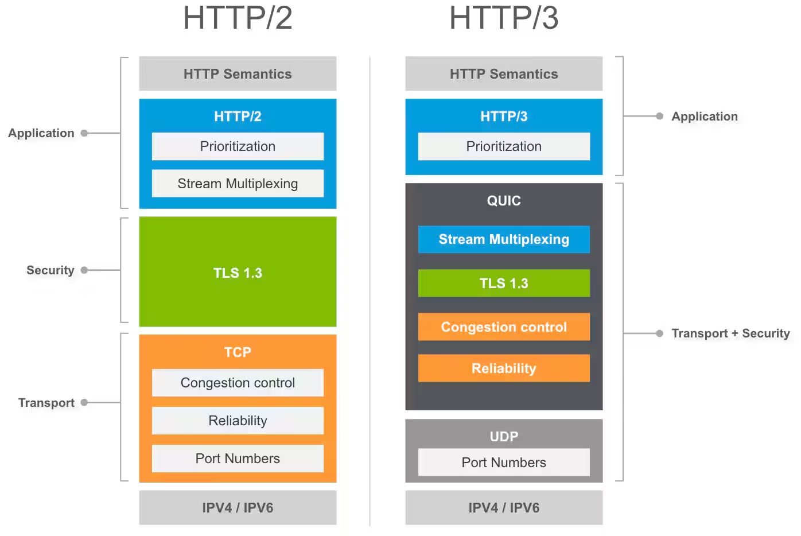
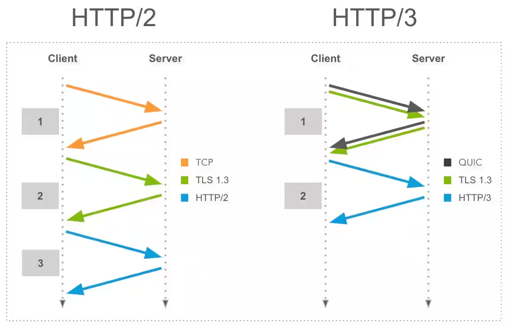

# HTTP

HTTP는 `Hypertext Transfer Protocol`의 줄임말이며 `world-wide web`(WWW)에서 데이터를 소통하는 방법입니다.

<aside>
💡 WWW(World Wide Web) : 인터넷에 연결된 사용자들이 서로의 정보를 공유할 수 있는 공간

</aside>

프로토콜(통신 규약)은 브라우저가 서버에게 데이터를 주고 받는 방법을 정의합니다. 모든 버전의 브라우저 프로토콜은 무언가를 요청(request)하고 서버는 데이터를 전달 또는 응답(response)함을 규정합니다.

### HTTP 요청의 기본 구조 예시 (PUT 요청)

```makefile
PUT /update-item/123 HTTP/1.1
Host: www.example.com
Content-Type: application/json
Content-Length: 40

{
  "name": "Updated Item",
  "price": 19.99
}
```

- **PUT**: HTTP 메소드
- **/update-item/123**: 요청할 자원의 경로 (여기서는 특정 자원의 ID를 포함)
- **HTTP/1.1**: HTTP 버전
- **Host**: 요청하는 서버의 도메인
- **Content-Type**: 전송되는 데이터의 타입
- **Content-Length**: 전송되는 데이터의 길이
- **본문**: 서버로 전송할 데이터 (예: JSON 형식으로 업데이트할 내용)

이러한 HTTP는 3개의 주요 버전이 있었습니다.

# HTTP/1.0과 HTTP/1.1

HTTP/1.0과 HTTP/1.1은 웹의 초기 발전을 이끈 중요한 프로토콜 버전입니다. 웹 페이지와 같은 리소스를 클라이언트(주로 웹 브라우저)와 서버 간에 전송하는 역할을 합니다. HTTP/1.0과 HTTP/1.1의 주요 특징을 설명하겠습니다.

### **HTTP/1.0**

HTTP/1.0은 1996년에 표준화된 최초의 HTTP 프로토콜입니다. 웹이 처음 등장했을 때 사용된 버전으로, 웹의 기본 동작 방식을 정의했습니다.

### **주요 특징**

- **비연결성(Connectionless):** HTTP/1.0은 요청을 처리한 후 연결을 끊는 방식입니다. 클라이언트가 서버에 요청을 보내면 서버는 응답을 보내고, 그 후 연결이 종료됩니다. 이는 각 요청마다 새로운 TCP 연결이 생성되고 종료됨을 의미합니다.
- **단일 요청/응답:** HTTP/1.0에서는 하나의 TCP 연결에서 하나의 요청과 하나의 응답만 처리할 수 있습니다. 즉, 웹 페이지를 로드할 때 필요한 모든 리소스(HTML, CSS, 이미지 등)에 대해 각각의 요청/응답 쌍이 필요합니다.
- **헤더 및 메서드:** `GET`, `POST`, `HEAD`와 같은 메서드를 지원하며, 각 요청에 대한 헤더를 전송할 수 있습니다. 하지만 헤더 정보가 비교적 간단하고, 많은 확장 기능이 지원되지 않았습니다.

### **단점**

- **비효율성:** 비연결성으로 인해 요청할 때마다 TCP 연결을 설정하고 종료해야 하므로 네트워크 리소스가 낭비되고, 응답 시간이 길어질 수 있습니다.
- **낮은 성능:** 단일 요청/응답 방식으로 인해, 웹 페이지의 모든 리소스를 하나씩 요청해야 하므로 전체 로딩 속도가 느립니다.

### **HTTP/1.1**

HTTP/1.1은 1997년에 표준화되었으며, 웹의 급속한 성장과 함께 더 많은 기능과 개선 사항을 추가한 버전입니다. HTTP/1.1은 현재까지도 널리 사용되고 있는 프로토콜입니다.

### **주요 특징**

- **지속 연결(Persistent Connections):** HTTP/1.1에서는 기본적으로 TCP 연결을 지속시킵니다. 여러 요청과 응답이 동일한 연결에서 처리될 수 있어, 네트워크 자원을 절약하고 성능을 개선합니다.
- **파이프라인(Pipelining):** 클라이언트는 여러 요청을 순차적으로 보내고, 서버는 그에 대한 응답을 순서대로 보낼 수 있습니다. 이를 통해 HTTP/1.0에서 발생했던 지연 문제를 완화할 수 있습니다. 그러나 파이프라인은 실질적인 사용에서 제한적이었습니다.
- **청크 전송(Chunked Transfer Encoding):** 서버는 콘텐츠 길이를 미리 알 필요 없이 데이터를 전송할 수 있습니다. 메시지를 일정 크기의 청크 여럿으로 쪼갠 후, 서버는 각 청크를 순차적으로 보냅니다. 이는 동적으로 생성되는 콘텐츠를 전송할 때 유용합니다.
- **호스트 헤더(Host Header):** HTTP/1.1에서는 `Host` 헤더가 필수입니다. 이를 통해 하나의 IP 주소에서 여러 도메인을 호스팅할 수 있습니다(가상 호스팅 지원).
- **추가 메서드:** `PUT`, `DELETE`, `OPTIONS`, `TRACE` 등 HTTP/1.0보다 다양한 메서드를 지원하여, 서버와 클라이언트 간의 상호작용을 더욱 유연하게 합니다.

### **장점**

- **성능 개선:** 지속 연결과 파이프라이닝을 통해 웹 페이지 로딩 시간을 단축하고, 네트워크 효율성을 높였습니다.
- **확장성:** HTTP/1.1은 다양한 헤더와 메서드를 통해 더 복잡한 웹 애플리케이션을 지원할 수 있도록 확장성을 제공합니다.

### **HTTP/1.0과 HTTP/1.1의 비교**

- **연결 방식:** HTTP/1.0은 비연결성을 가지지만, HTTP/1.1은 지속 연결을 기본으로 합니다.
- **요청 처리:** HTTP/1.0은 단일 요청/응답을 지원하는 반면, HTTP/1.1은 파이프라이닝으로 여러 요청을 처리할 수 있습니다.
- **캐싱 및 압축:** HTTP/1.1은 더 나은 캐싱 메커니즘과 청크 전송 인코딩을 지원하여, HTTP/1.0보다 효율적인 데이터 전송을 가능하게 합니다.

HTTP/1.0은 웹의 초기 단계에서 중요한 역할을 했지만, 비효율적인 연결 관리와 낮은 성능으로 인해 한계가 있었습니다. HTTP/1.1은 이러한 한계를 극복하고 더 나은 성능과 유연성을 제공함으로써, 웹의 발전에 크게 기여했습니다. HTTP/1.1의 도입은 웹 애플리케이션의 성능과 사용자 경험을 크게 향상시켰고, 오늘날에도 많은 웹사이트에서 여전히 사용되고 있습니다.

# HTTP/2

HTTP/2는 2015년에 표준화된 웹 프로토콜로, HTTP/1.1의 한계를 극복하고 웹 성능을 크게 개선하기 위해 도입되었습니다. HTTP/2는 구글의 `SPDY` 프로토콜을 기반으로 개발되었으며, 다음과 같은 주요 특징을 가지고 있습니다.


<aside>
💡 SPDY  : 웹 콘텐츠를 전송할 목적으로 구글이 개발한 비표준 개방형 네트워크 프로토콜

</aside>

## 주요 특징

- **멀티플렉싱 (Multiplexing)**
  - **동시 요청 처리:** HTTP/2는 단일 TCP 연결에서 여러 요청과 응답을 동시에 처리할 수 있습니다. HTTP/1.1에서는 하나의 연결에서 한 번에 하나의 요청과 응답만 처리(순차 처리)할 수 있었던 반면, HTTP/2에서는 여러 요청이 **병렬**로 이루어지므로, 웹 페이지 로딩 속도가 크게 향상됩니다.
  - **헤드 오브 라인 블로킹(Head-of-Line Blocking) 문제 해결:** HTTP/1.1에서는 이전 요청이 완료되기 전까지 새로운 요청을 시작할 수 없었습니다. 그러나 HTTP/2에서는 각 요청이 독립적으로 처리되기 때문에 이 문제가 해결되었습니다.
- **헤더 압축 (Header Compression)**
  - **중복 헤더 제거:** HTTP/2는 동일한 헤더가 반복적으로 전송되는 것을 피하기 위해 헤더 테이블을 유지하며, 이를 통해 불필요한 데이터 전송을 줄입니다.
- **서버 푸시 (Server Push)**
  - **예측적 리소스 전송:** 서버는 클라이언트가 요청하지 않은 리소스도 미리 전송할 수 있습니다. 예를 들어, 클라이언트가 HTML 페이지를 요청하면, 해당 페이지에 필요한 CSS 파일과 JavaScript 파일을 서버가 미리 푸시할 수 있습니다. 이를 통해 웹 페이지 로딩 시간을 단축할 수 있습니다.
  - **네트워크 대기 시간 감소:** 서버 푸시는 클라이언트가 요청을 보내기 전에 필요한 리소스를 전송하므로, 네트워크 대기 시간을 줄이고 사용자 경험을 향상시킵니다.
- **스트림 우선순위 (Stream Prioritization)**
  - **우선순위 설정:** 클라이언트는 요청한 리소스의 중요도를 기반으로 우선순위를 설정할 수 있습니다. 서버는 이 우선순위를 고려하여 중요한 리소스를 먼저 전송합니다. 이를 통해 웹 페이지의 주요 요소가 더 빨리 로딩되어 사용자에게 빠른 응답을 제공합니다.
  - **효율적인 대역폭 사용:** 중요도가 높은 리소스를 먼저 전송함으로써, 대역폭을 효율적으로 사용할 수 있습니다.
- **이진 프레이밍 계층 (Binary Framing Layer)**
  - **데이터 프레임 전송:** HTTP/2는 텍스트 기반의 HTTP/1.1과 달리, 데이터를 이진 프레임(Binary Frame)으로 전송하여 더욱 신속하게 처리합니다.
  - **프레임 구조:** HTTP/2는 데이터를 작은 프레임으로 나누어 전송함. 따라서 네트워크 오류가 발생했을 때, 특정 프레임만 재전송하면 되므로 데이터 전송이 더 안정적입니다.
- **향상된 보안**
  - HTTP/2는 기본적으로 HTTPS와 통합되어 더 안전한 통신을 지원함. HTTP/2는 암호화된 연결(SSL/TLS) 위에서 동작하며, 이는 사용자 데이터의 보안을 강화함.
  - HTTP/2는 DDoS 공격과 같은 네트워크 공격을 방지하기 위해 설계되었습니다.

## **HTTP/2의 장점**

- **속도 향상:** 멀티플렉싱, 헤더 압축, 서버 푸시와 같은 기술을 통해 HTTP/2는 HTTP/1.1보다 훨씬 빠른 응답 속도를 제공
- **네트워크 효율성:** HTTP/2는 대역폭을 효율적으로 사용하고, 불필요한 데이터 전송을 줄여 네트워크 효율성을 극대화
- **호환성:** HTTP/2는 HTTP/1.1과 하위 호환되므로, 기존 HTTP/1.1을 사용하는 웹 애플리케이션과도 호환성을 유지

## **HTTP/2의 채택**

- 대부분의 현대 웹 브라우저와 서버 소프트웨어는 HTTP/2를 지원
- 구글, 페이스북, 아마존 등 주요 웹사이트와 서비스는 이미 HTTP/2를 채택하여 더 빠르고 안정적인 사용자 경험을 제공
- HTTP/2는 하위 호환성이 있어, 기존 HTTP/1.1 인프라를 사용하면서도 점진적으로 도입할 수 있습니다. 이로 인해 많은 웹사이트가 HTTP/2로 전환하고 있습니다.
- HTTP/2는 웹의 성능을 대폭 향상시키기 위해 도입된 중요한 프로토콜입니다. 멀티플렉싱, 헤더 압축, 서버 푸시 등의 기능을 통해 HTTP/1.1의 한계를 극복하고, 더 빠르고 효율적인 웹 경험을 제공합니다.

# HTTP/3

HTTP/3는 HTTP 프로토콜의 최신 버전으로, 웹의 성능과 보안을 한 단계 더 발전시키기 위해 설계되었습니다. 2020년에 표준화된 HTTP/3는 TCP 대신 QUIC(Quick UDP Internet Connections)라는 새로운 전송 프로토콜을 사용하며, HTTP/2의 여러 단점을 개선했습니다.

- **QUIC 프로토콜**
  - **UDP 기반 전송:** HTTP/3는 TCP 대신 UDP를 사용합니다. UDP는 연결 설정이 빠르고 데이터 전송이 더 유연하지만, 기본적으로 신뢰성 보장 메커니즘이 없다는 단점이 있습니다. QUIC는 이 UDP 위에서 동작하며, TCP의 장점(예: 신뢰성, 흐름 제어)을 결합하면서도 더 나은 성능을 제공합니다.
  - **연결 설정 속도:** HTTP/3는 0-RTT(Zero Round Trip Time) 연결 설정을 지원합니다. 즉, 기존 연결이 있었던 서버와의 연결을 새로 설정할 때, 추가적인 왕복 시간이 필요 없이 데이터를 즉시 전송할 수 있습니다. 이는 웹 페이지 로딩 시간을 크게 줄여줍니다.
- **스트림 관리 및 복구**
  - **독립적인 스트림 처리:** HTTP/3에서는 각 스트림이 독립적으로 관리됩니다. HTTP/2에서는 단일 스트림의 문제가 전체 연결에 영향을 줄 수 있었지만, HTTP/3에서는 특정 스트림에 오류가 발생하더라도 다른 스트림에는 영향을 미치지 않습니다. 이를 통해 네트워크 오류나 손실에도 불구하고 더 안정적인 데이터 전송이 가능합니다.
  - **향상된 데이터 복구:** QUIC는 패킷 손실 시 전체 패킷을 재전송하는 대신, 손실된 부분만 재전송하여 더 효율적으로 데이터를 복구할 수 있습니다. 이는 특히 불안정한 네트워크 환경에서 큰 이점을 제공합니다.
- **연결 이동성 (Connection Migration)**
  - HTTP/3는 네트워크 환경이 변경되어 IP 주소가 바뀌더라도 연결을 끊지 않고 유지할 수 있습니다. 예를 들어, 사용자가 Wi-Fi에서 이동통신 네트워크로 전환할 때, 기존 연결을 끊지 않고 그대로 이어갈 수 있습니다.

### **결론**

HTTP/3는 웹 프로토콜의 최신 발전으로, 성능과 보안에서 큰 개선을 제공함. QUIC 기반의 HTTP/3는 더 빠른 연결 설정, 더 안정적인 데이터 전송, 그리고 향상된 보안을 통해 웹의 사용자 경험을 크게 향상 시켰습니다.



- UDP는 대부분의 디바이스와 호환되며 기능 세트가 작기 때문에 TCP보다 민첩
- HTTP/3는 TLS 1.3과 통합된 QUIC은 보안 연결을 설정하는 데 필요한 네트워크 왕복 횟수를 줄여줌



TCP의 경우 연결 설정을 위해 별도의 3방향 핸드셰이크가 필요하므로 지연 시간이 늘어납니다. 반면 QUIC는 TLS 1.3과의 긴밀한 통합을 통해 전송 및 암호화 핸드셰이크를 한 번의 왕복에 결합합니다. 따라서 연결 설정에 필요한 시간이 크게 줄어듭니다
