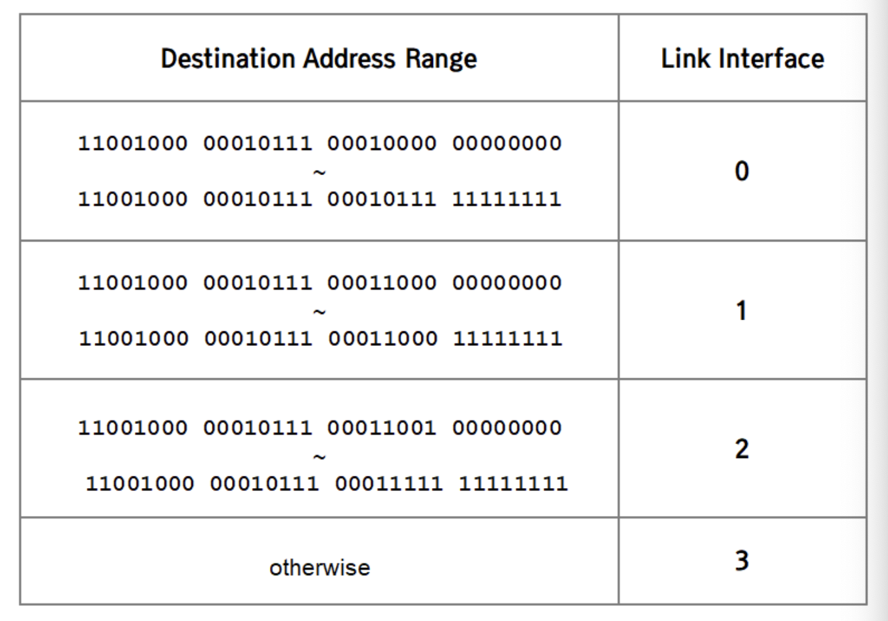
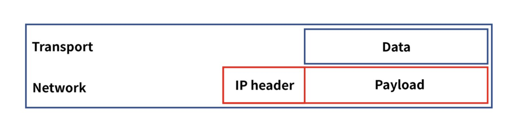
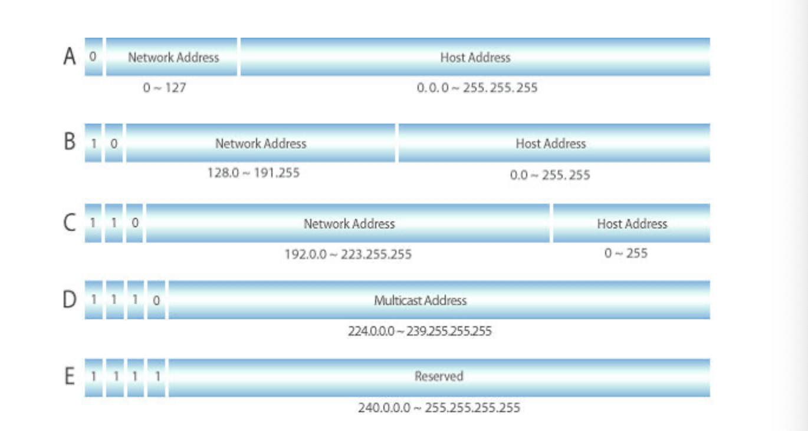
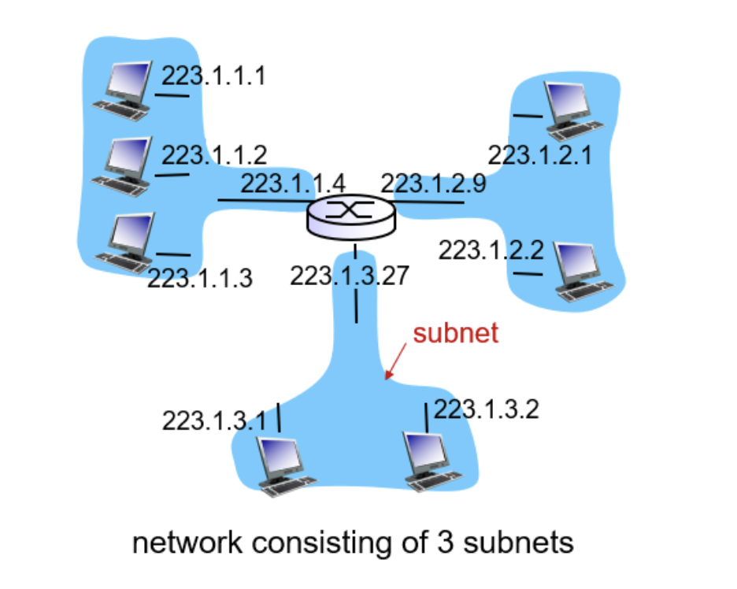
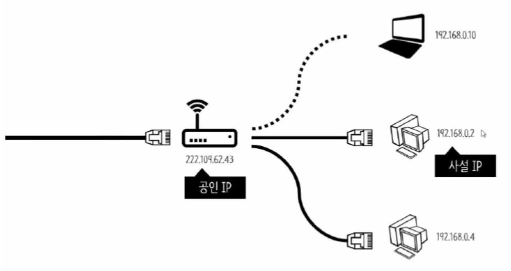

# IP

## 네트워크 계층과 IP

**네트워크 계층**은 데이터를 목적지까지 안전하고 빠르게 전달하는 계층.

다른 네트워크에 있는 컴퓨터에 데이터를 보내기 위해서 패킷을 전송하는 장치인 **라우터**라는 장비가 필요하고, **IP주소**를 알고 있어야 한다.

최종 목적지에 도달하려면 어떻게 가야되는지 알려주는 것을 **라우팅**이라고 하며, 네트워크 계층은 **라우팅 테이블**을 통해 최적의 경로를 선택해 IP주소를 통해 패킷을 전달한다.

### 네트워크 계층의 두 가지 기능

- 포워딩
  - 라우터의 입력 포트에서 출력 포트로 패킷이 옮겨지는 것
  - DATA PLANE의 영역
- 라우팅
  - 패킷 단위로 출발지부터 목적지까지의 경로를 구축하는 것
  - CONTROL PLANE의 영역

과거에는 라우터 내에서 포워딩, 라우팅을 둘 다 했었음.

하지만 **포워딩은 하드웨어 영역에서 발생**하여 nanosecond 단위가 소모되고, **라우팅은 소프트웨어 영역에서 발생**하므로 millisecond 단위가 소모되어 오버헤드가 큰 라우팅을 따로 분리하게 된다. 라우팅을 **원격 서버(remote server)**에서 관리하는 것을 **SDN(Software-defined network)**라고 하고 현재는 이를 사용한다.

**포워딩**은 두 가지 종류가 있는데, 목적지의 IP주소를 기반의 포워딩해주는 목적지 기반의 포워딩이 전통적인 방법임.

**control plane**에서 만든 라우팅 테이블에서 IP주소를 찾아 해당하는 Link Interface로 전달한다

## IP

Internet Protocol 네트워크 계층에서 통신하는 주요 규칙 프로토콜

네트워크 계층에서는 전송계층에서 받은 데이터(세그먼트)를 캡슐화한 뒤 IP header를 붙여 데이터그램을 만듦. (데이터그램 = 패킷)

### IP datagram 구조

IP header는 출발지, 목적지 ip주소 등의 정보를 가진다.

### IP address

네트워크 환경에서 컴퓨터(노드)간 데이터를 주고받기 위해 각 컴퓨터에 부여된 네트워크 상 주소를 말함.

현재 가장 많이 활용되고 있는 버전은 IPv4이다.

## IPV4

32비트 길이의 식별자로 8비트씩 4개의 구간으로 나누어짐.

0.0.0.0~255.255.255.255까지 약 42억개의 주소를 만들 수 있음.

IP주소는 네트워크 ID + 호스트 ID 로 구성되어 있다.

**네트워크 ID는** 네트워크를 구분하는 ID.

호스트가 같은 네트워크 상에 있다면 네트워크 ID또한 같으며 서로 자유롭게 통신할 수 있다.

**호스트 ID는** 해당 네트워크에 속한 사용자에게 부여하는 고유의 번호

## IPv4 class

클래스는 IP주소에서 네트워크 영역과 호스트 영역을 나누는 방법이다.

하나의 네트워크에서 몇 개의 호스트 IP까지 가질 수 있는가에 따라 A, B, C, D, E 다섯개의 클래스로 구분한다. 주로 A,B,C클래스에 속한 ip를 사용.

A클래스는 IP의 앞자리가 `0 ~ 127`, B클래스는 `128.0 ~ 191.255`, C클래스는 `129.0.0 ~ 223.255.255`로 구성된다. 이는 각 클래스의 **네트워크 ID**를 의미한다

A클래스에서는 IP의 첫 번째 블락만 같으면 같은 네트워크에 속해있다는 의미이고, B클래스는 두 번째 블락, C클래스는 세 번째 블락까지 같아야 같은 네트워크라는 의미이다.

네트워크 주소를 제외하고 나머지는 **Host ID**로 해당 네트워크에서 몇 개의 IP가 만들어질 수 있는지를 결정한다.

A클래스는 가질 수 있는 호스트 수가 제일 많은 클래스이다. 이 클래스는 2^24 - 2개의 호스트를 가질 수 있다.(2개 중 하나는 모든 비트가 1인 브로드캐스트 주소이고 하나는 모든 비트가 0인 네트워크 주소이다)

### Subnet

클래스로만 네트워크를 분류하는 것이 비효율적이기 때문에 IP개수를 낭비하지 않고 적절한 단위로 네트워크를 분할하기 위해 탄생한 개념

네트워크를 분할하는 것을 **서브네팅**이라고 하며 서브네팅은 **서브넷 마스크를** 통해 이루어진다.
`11001101 00000000 00000001 xxxxxxxx`

이 IP주소는 최상위 비트가 11이므로 C Class 네트워크라고 할 수 있다. 앞의 24비트는 네트워크의 주소이고 뒤의 8비트는 호스트 주소이다. **서브넷 마스크 값은 네트워크 주소를 나타내는 비트 수를 명시한 값**이다. 기본적으로 C Class 네트워크는 기본 서브넷 마스크로 /24 를 가지고 있다. 이를 2진수로 표현하자면 11111111 11111111 11111111 00000000 으로 표현될 수 있을 것이다.

현재 이 네트워크는 256개의 호스트 주소를 가지고 있으나, 호스트를 128개씩 가지는 두 개의 네트워크로 분할하고 싶을 때 서브넷을 사용한다.

`11001101 00000000 00000001 1xxxxxxx`

`11001101 00000000 00000001 0xxxxxxx`

위와 같이 네트워크를 분할하고 싶다면, 네트워크 주소를 나타내는 부분이 25자리로 기존의 C Class 네트워크보다 네트워크 주소를 나타내는 부분이 한 자리 더 많다. 이렇게 되면 서브넷 마스크는 /25 라고 표현할 수 있을 것이다. 이와 같이 서브넷 마스크를 개수로 표현한 것을 CIDR라고 한다. (Classless InterDomain Routing)

서브넷은 독립된 네트워크로 라우터를 거치지 않고 통신이 가능하다.

### 사설 IP

**공인 IP** 는 ISP(인터넷 서비스 공급자)가 제공하는 IP 주소이며, 외부에 공개되어 있는 IP주소이다.

반면 **사설 IP**는 내부에서만 사용할 수 있는 Ip이다.

IPv4의 주소부족으로 인해 서브넷팅된 IP로, 일반 가정이나 회사 등 내부 라우터(공유기)에 의해 로컬 네트워크상의 PC나 장치에 할당된다. 외부와 중복되어도 상관 없다.
• 사설 IP 주소만으로는 인터넷에 직접 연결할 수 없고, 라우터를 통해 1개의 공인 IP를 할당하고, 라우터에 연결된 개인 PC는 사설 IP를 각각 할당 받아 인터넷에 접속 할 수 있다.

이를 통해 하나의 IP를 가지고도 여러 기기들을 연결할 수 있다. 같은 서브넷에 속한 Private IP들은 서로 접속할 수 있고, 외부의 접속을 차단할 수 있다.

Private IP로는 다음의 대역만을 사용한다.

- `10.0.0.0` ~ `10.255.255.255`
- `172.16.0.0` ~ `172.31.255.255`
- `192.168.0.0` ~ `192.168.255.255` - 공유기에서 많이 보는 대역

### IPv6

현재 ipv4가 고갈되어 128비트로 확장된 주소체계이다.

[[네트워크] IP 계층(IP Layer) - IP 주소와 라우팅](https://velog.io/@redgem92/네트워크-IP-주소와-라우팅)

[쉽게 설명하는 네트워크 (IP주소, DNS, 네트워크, 호스트, CIDR, Private IP, 포트포워딩)](https://sjquant.tistory.com/59)
