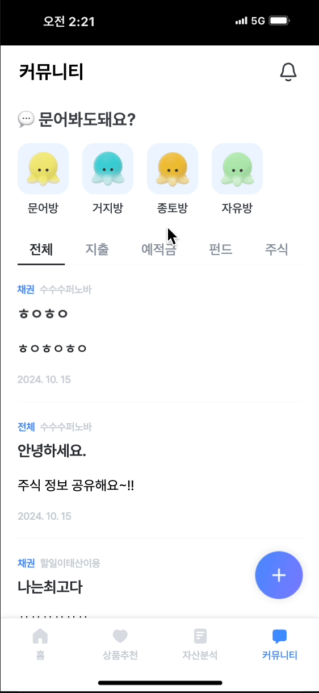

# WebSocket과 STOMP

### 실시간 채팅 기능을 구현하기 위해 WebSocket과 STOMP 프로토콜을 활용하여, 서버와 클라이언트 간의 비동기 통신을 가능하게 함

- **기술 스택**
    - **Frontend**: Vue.js
    - **Backend**: Spring Framework (STOMP 및 WebSocket 지원)
    - **프로토콜**: STOMP (Simple Text Oriented Messaging Protocol)
    - **웹소켓 서버**: Spring Framework에서 제공하는 WebSocket API
        - Spring은 WebSocket을 사용하면 STOMP를 지원해줌

- **WebSocket**
    - 클라이언트와 서버 간의 양방향 통신을 가능하게 하는 프로토콜
    - 데이터 송/수신을 동시에 처리할 수 있어서, 연속된 데이터를 빠르게 교환 가능
    - HTTP와 달리 WebSocket은 연결을 유지한 상태에서 **실시간 데이터를 주고받**을 수 있음
    - HTTP와 달리 요청-응답 패턴이 아닌 **지속적인 연결**을 통해 데이터가 필요할 때 즉시 전송
- **STOMP**(Simple Text Oriented Messaging Protocol)
    - WebSocket 상에서 메시지를 주고받기 위한 프로토콜
    - WebSocket 자체는 메시지 형식이나 라우팅 방식을 제공하지 않기 때문에, STOMP를 사용하여 메시지를 **특정 구독자(채팅방 참가자)에게 전송**할 수 있음
    - 메시지 브로커를 활용하여 채팅 통신을 위한 형식을 정의
        - Publish-Subscribe 구조: 메시지를 공급하는 주체와 소비하는 주체를 분리해 메시징을 제공
        - Message Broker: 발신자가 메시지를 발행하면 수신자들이 발행된 메시지를 수신하도록 메시지를 전달하는 주체

```
GET /chat HTTP/1.1
Host: localhost:8080
Upgrade: websocket
Connection: Upgrade
Sec-WebSocket-Key: x3JJHMbDL1EzLkh9GBhXDw==
Sec-WebSocket-Protocol: chat, superchat
Sec-WebSocket-Version: 13
Origin: http://localhost:9000
```

**GET /chat HTTP/1.1**  
웹소켓의 통신 요청에서,
HTTP 버전은 1.1 이상이어야하고 GET 메서드를 사용해야햔다.

 
**Upgrade**  
프로토콜을 전환하기 위해 사용하는 헤더.
웹소켓 요청시에는 반스에 websocket 이라는 값을 가지며,
이 값이 없거나 다른 값이면 cross-protocol attack 이라고 간주하여 웹 소켓 접속을 중지시킨다.

 

**Connection**  
현재의 전송이 완료된 후 네트워크 접속을 유지할 것인가에 대한 정보.
웹 소켓 요청 시에는 반드시 Upgrade 라는 값을 가진다.
Upgrade 와 마찬가지로 이 값이 없거나 다른 값이면 웹소켓 접속을 중지시킨다.

 

**Sec-WebSocket-Key**   
유효한 요청인지 확인하기 위해 사용하는 키 값

 

**Sec-WebSocket-Protocol**  
사용하고자 하는 하나 이상의 웹 소켓 프로토콜 지정.
필요한 경우에만 사용

 

**Sec-WebSocket-Version**  
클라이언트가 사용하고자 하는 웹소켓 프로토콜 버전.
현재 최신 버전 13

 
## 웹 소켓이 나오기 전까지의 통신 방식
### Polling 방식
일정한 주기로 서버에 요청(Request)을 보내는 방법
setTimeout, setInterval 등으로 일정 주기마다 서버에 요청(Request)을 보냄

- 단점
    - 불필요한 Request 와 Connection을 생성하여 서버에 부담을 준다.
    - 요청 주기가 짧을 수록 부하가 커진다.
    - '일정 주기마다' 요청을 보내는 것이기 때문에 실시간이라고 보기에 애매하다.
    - 요청 주기가 짧으면 실시간 처럼 보이겠지만, 실제로 실시간은 아니다.
    - HTTP 통신을 하기 때문에 Request, Response 헤더가 불필요하게 크다.

<hr>

## **구현 과정**

### **Spring Framework에서 WebSocket 설정**

- **WebSocket Configuration**:
Spring에서 WebSocket과 STOMP를 설정하기 위해 `WebSocketMessageBrokerConfigurer` 인터페이스를 구현
    
    ```java
    @Configuration
    @EnableWebSocketMessageBroker
    public class WebSocketConfig implements WebSocketMessageBrokerConfigurer {
    
        @Override
        public void registerStompEndpoints(StompEndpointRegistry registry) {
            registry.addEndpoint("/ws")
                    .setAllowedOriginPatterns("*")
                    .withSockJS();
        }
    
        @Override
        public void configureMessageBroker(MessageBrokerRegistry config) {
            config.enableSimpleBroker("/topic");
            config.setApplicationDestinationPrefixes("/app");
        }
    }
    
    ```
    
- **설명**:
    - `/ws` 엔드포인트를 통해 클라이언트가 WebSocket을 연결함
    - 메시지를 브로드캐스팅하기 위해 `/topic`을 사용하고, 클라이언트로부터 오는 메시지는 `/app`으로 라우팅

### 3.2. **메시지 처리 로직 (Spring Controller)**

- 클라이언트로부터 전송된 메시지를 처리하는 `MessageController` 작성.
    
    ```java
    java
    코드 복사
    @Controller
    public class ChatController {
    
        @MessageMapping("/chat.sendMessage")
        @SendTo("/topic/public")
        public ChatMessage sendMessage(@Payload ChatMessage chatMessage) {
    		    // service logic..
            return chatMessage;
        }
    }
    
    ```
    
- **설명**:
    - 클라이언트가 `/app/chat.sendMessage`로 메시지를 전송하면, 해당 메시지를 처리하고 `/topic/public`으로 구독자에게 전달.

### 3.3. **Vue.js에서 WebSocket 연결**

- Vue.js 클라이언트는 `SockJS`와 `STOMP`를 사용하여 WebSocket에 연결하고 메시지를 송수신
    
    ```jsx
    javascript
    코드 복사
    import SockJS from "sockjs-client";
    import Stomp from "webstomp-client";
    
    export default {
      data() {
        return {
          stompClient: null,
          messages: [],
        };
      },
      methods: {
        connect() {
          const socket = new SockJS("/ws");
          this.stompClient = Stomp.over(socket);
          this.stompClient.connect({}, frame => {
            this.stompClient.subscribe("/topic/public", 
              this.onMessageReceived
            );
          });
        },
        sendMessage(messageContent) {
          if (messageContent && this.stompClient) {
            const chatMessage = {
              content: messageContent,
              sender: this.username,
            };
            this.stompClient.send("/app/chat.sendMessage", JSON.stringify(chatMessage), {});
          }
        },
      },
      onMessageReceived(payload) {
          const message = JSON.parse(payload.body);
          if (message.sender === this.nickname) return;
          this.messages.push({
            ...message,
            time: new Date().toLocaleTimeString('ko-KR', {
              hour: '2-digit',
              minute: '2-digit',
            }),
          });
          this.scrollToBottom();
        },
      mounted() {
        this.connect();
      },
    };
    
    ```
    
- **설명**:
    - `SockJS`를 통해 `/ws`에 연결하고, `STOMP`를 사용하여 `/topic/public`에서 수신한 메시지를 구독
    - 사용자가 메시지를 입력하면 `/app/chat.sendMessage`로 메시지를 전송
    - 전송된 메세지는 `@MessageMapping("/chat.sendMessage")` 에 도달하고, `@SendTo("/topic/public")` 경로를 구독한 구독자들에게 메세지 전송
    
    ```java
    this.stompClient.subscribe("/topic/public", 
      this.onMessageReceived
    );
    ```
    
    구독한 사용자들은 메세지가 오면 `onMessageReceived` 를 통해 수신한 메세지 처리
    

### **실시간 채팅 기능**

- 사용자들이 각 채팅방에 입장하면, 서버와 WebSocket을 통해 연결을 유지하고, 서버에서 전송되는 메시지는 즉시 클라이언트 화면에 표시
- 메시지 전송 시에는 STOMP 프로토콜을 이용하여 특정 구독 채널 구독자들에게 메시지 브로드캐스팅

# 프로젝트를 진행하며 막혔거나 고려했던 점

### `config.setApplicationDestinationPrefixes("/app");` 의 필요성

- 서버에서 추가 로직을 처리해야 하는 경우에 사용

ex) 채팅 메시지를 데이터베이스에 저장한 후 다시 브로드캐스트하는 등의 추가 처리가 필요할 때

- 우리 서비스의 채팅방은 클라이언트가 메시지를 바로 브로커(`/topic`)로 보내고, 브로커에서 해당 메시지를 구독자들에게 바로 전달하기에 `/app`과 같은 prefix를 사용할 필요가 없었다.

### [FE] npm 설치 대신 CDN을 통해 직접 index.html 파일에 포함

- 버전 문제로 인해 `sockjs-client`와 `stomp.js` 가 npm으로 설치가 안되는 상황 발생
- npm 패키지를 사용하는 대신, CDN을 통해 외부 라이브러리를 HTML 파일에 직접 포함하는 방식으로 변경

```java
<script src="https://cdn.jsdelivr.net/npm/sockjs-client@1/dist/sockjs.min.js"></script>
<script src="https://cdnjs.cloudflare.com/ajax/libs/stomp.js/2.3.3/stomp.min.js"></script>
```

- `window` 객체를 사용하여 객체를 통해 글로벌 스코프에서 라이브러리를 사용

```java
const socket = new window.SockJS('http://localhost:8080/ws');
const stompClient = window.Stomp.over(socket);
```

### 이미지 전송 시 Base64 인코딩 문제 해결 방법

**문제**

STOMP를 사용해 이미지 전송 시, 이미지가 Base64로 인코딩되면서 데이터 크기가 커짐. 이로 인해 서버에서 이미지 크기가 너무 커서 전송을 받지 못하는 문제가 발생함.

**해결 방안**

Base64 인코딩 이미지 전송하기 전에, 이미지의 크기를 조정하고 압축하여 전송 데이터의 크기를 줄여 해결.


