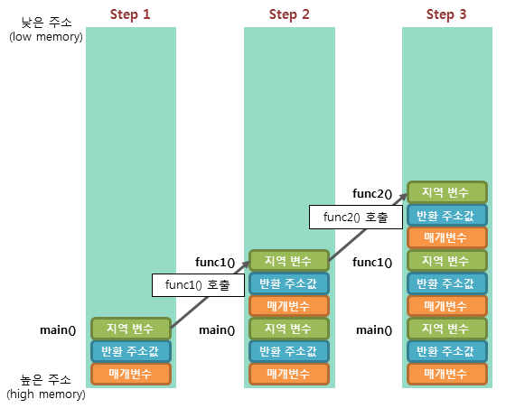

# [운영체제] 메모리 구조

Created: 2024년 6월 17일 오전 9:58
Type: Note
Category: CS

**Description:**

### 🤔 메모리 구조란? 필요성

➡️ 프로그램이 실행(📌CPU가 명령어가 저장된 곳, 코드 영역에서 명령어를 읽어와서 이를 수행하는 동작)될려면 먼저 프로그램이 (📌주기억장치)메모리(RAM)에 로드(load)되어야 한다.

📌 프로그램 실행 동작 과정 정리


1. 프로그램의 실행을 요청 
2. 운영체제에서 프로그램의 정보를 읽어서 메모리(RAM)에 로드(load)한다. 
    1. RAM에 로드하는 이유 : CPU가 접근해서 명령어들을 실행할 수 있게 하기 위해서
    2. 프로그램의 정보는 기본적으로 파일 시스템이라는 비휘발성 디스크에 실행파일 형태로 저장되어 있다. 

추가적으로 프로그램에서 사용되는 변수들을 저장하기 위한 공간이 필요한데,  이 공간이 바로 **메모리**다. 

메모리의 관리에 따라 프로그램의 성능이 차이가 나게 된다. 따라서 메모리를 효율적으로 사용하기 위해서는 메모리 구조와 특징에 대해 이해할 필요가 있다.

<br>
메모리에 로드(load)될 데이터는 컴퓨터의 운영체제에서 제공 한다. 

🤔운영체제란 컴퓨터 시스템의 하드웨어와 소프트웨어의 자원을 관리하는 것이다.

컴퓨터의 운영체제가 프로그램에 제공해주는 대표적인 메모리 공간이 다음 4개이다. 

1. 코드(code) 영역
2. 데이터(data) 영역
3. 스택(stack) 영역
4. 힙(heap) 영역

아래의 그림이 위 4개의 메모리 공간을 구조화해서 표현한 그림이다. 


📌 위의 그림에 대한 예시) with C언어 코드




<br><br>
### ✅ 코드(code) 영역

- 코드 영역에서 CPU는 저장된 명령어를 하나씩 가져가서 처리한다.
- 실행할 프로그램의 코드(명령어가)가 0과 1로 이루어진 기계어 형태로 저장된 영역
- 코드 영역은 컴파일 타임에 결정이 되고, 중간 변경으로부터 안전하게 보호하기 위해 Read-Only 형태로 저장된다.

~~명령어들에는 제어문, 함수, 상수 등이 있다.~~  

쉽게 말해서 프로그래머가 작성한 코드가 기계어로 저장이 된다.

🤔 컴파일 타임에 코드 영역이 결정됨

프로그램의 코드가 실행될 위치는 컴파일 과정에서 미리 결정이 되고 코드의 크기와 구조 또한확정되기 때문에 실행 시점에서는 동적으로 변경되지 않는다.

🤔 컴파일 타임이란?

프로그램을 작성한 소스 코드를 컴파일러가 기계어로 번역하는 시점. 프로그램의 코드, 전역 변수, 정적 변수 등의 위치가 결정되고 이러한 정보들이 실행 파일에 포함된다.

🤔 컴파일 타임에 코드 영역이 결정되는 이유

**효율성**: 코드 영역의 위치를 컴파일 타임에 미리 결정함으로써, 프로그램 로드 시 복잡한 메모리 할당 과정을 거치지 않고, 정해진 위치에 빠르게 로드할 수 있다.

**안정성**: 코드가 고정된 위치에 로드되므로, 코드의 실행 중에 위치가 변하지 않아 예측 가능한 실행 환경을 제공한다고 한다.


<br><br>
### ✅ 데이터(data) 영역

- 프로그램의 **전역 변수**와 **정적 (static) 변수**가 저장되는 영역
- 데이터 영역은 프로그램의 시작과 함께 할당이 되고, 프로그램의 종료와 함께 소멸하게 된다.
- 어느 곳에서든지 접근하고 , 참조할 수 있는 데이터들이 모여있느 곳이며, 실행 도중 전역 변수의 값이 변경될 수 있어, Read-Write 로 지정이 된다.

🤔 데이터 영역에 위치하는 데이터들의 특징

1. **고정된 메모리를 할당**한다. 프로그램 실행 초기와 종료에만 영향을 받고 중간에 메모리 할당과 해제 등의 과정이 반복되지 않기 떄문
2. (전역 변수일 경우) 프로그램 실행 중, 언제 어디서 참조해도 변수의 값은 일관된 값을 반환한다. 
3. 주로 프로그램의 상태를 관리하거나 특정 설정 값을 공유할 때 유용하다.

📌 data 영역과 bss
- 변수 선언은 초기화 과정과 상관 없이 선언이 된다. 이때 초기화된 전역 변수는 data 영역에, 초기화되지 않은 전역 변수는 BSS(block started by Symbol) 영역에 변수를 위치 시킨다.
- 이유 : 초기화를 하게 되면 초기화 된 것 만큼의 크기로 데이터가 메모리에 할당되기 때문이다. 때문에 초기화되지 않은 전역 변수는 따로 메모리 할당 작업이 없기 때문에 프로그램의 크기를 늘리지 않게 된다.
- 예시)

    ```java
    // 초기화 O, data
    public class program1 {
    
      static int[] arr1 = {
          -1, -1, -1, -1, -1, -1, -1, -1, -1, -1,
          -1, -1, -1, -1, -1, -1, -1, -1, -1, -1 ,
          -1, -1, -1, -1, -1, -1, -1, -1, -1, -1 ,
          -1, -1, -1, -1, -1, -1, -1, -1, -1, -1 ,
          -1, -1, -1, -1, -1, -1, -1, -1, -1, -1 ,
          -1, -1, -1, -1, -1, -1, -1, -1, -1, -1 ,
          -1, -1, -1, -1, -1, -1, -1, -1, -1, -1 ,
          -1, -1, -1, -1, -1, -1, -1, -1, -1, -1 ,
          -1, -1, -1, -1, -1, -1, -1, -1, -1, -1 ,
          -1, -1, -1, -1, -1, -1, -1, -1, -1, -1 };
    
      public static void main(String[] args) {
    
      }
    
    }
    
    ```
    
    
    ```java
    // BSS
    public class program2 {
      static int[] arr2 = new int[100];
    
      public static void main(String[] args) {
    
      }
    }
    
    ```
    


<br><br>
### ✅ 스택 (stack) 영역

- 함수의 호출과 관계되는 지역 변수와 매개변수가 저장되는 영역
- 앞선 데이터 영역과 달리 프로그램 실행과 종료 단계 외에도 중간에 할당과 제거 등의 과정이 존재
    - 할당과 제거는 함수의 호출과 연관이 있다. 함수의 호출과 함께 스택에는 함수의 매개변수, 호출이 끝난 뒤에 돌아갈 반환 주소값, 함수 내에서 선언된 지역 변수 등의 데이터가 할당되고, 함수의 호출이 완료되면 이와 동시에 소멸되게 된다.

➡ 함수의 호출과 해제 시점을 정확히 기록하는 것이 중요. 스택 영역에서는 **스택 프레임**(stack frame) 을 활용해서 함수의 호출 정보를 저장해놓는다. 

🤔  스택 프레임이란?

스택 영역에 차례대로 저장되는 함수의 호출 정보로, 함수의 매개변수, 지역 변수, 호출이 끝난 뒤 돌아갈 리턴 주소 등을 저장한다.

스택 프레임 동작 방식 예시)

- 기본 구조 : LIFO (Last In First Out) 동작 방식
    - 특징 : 스택 영역은 메모리의 높은 주소에서 낮은 주소의 방향으로 할당이 된다.

🤔 메모리의 높은 주소, 낮은 주소

우선 스택 영역과 힙 영역은 **메모리의 같은 공간을 사용**한다고 한다. 때문에 서로 사용영역에 영향을 미치게 되는데, 이를 최소화 하기 위해서는 **힙과 스택에서 데이터는 서로 쌓이는 방향이 반대**여야 한다. 

(+ 만약 서로의 영역을 침범하게 되면, 이를 overflow가 발생했다고 할 수 있다.)

**스택**은 일반적으로 메모리의 **높은 주소에서 낮은 주소 방향으로** 성장한다. 예를 들어 함수를 호출하면 새로운 스택 프레임이 할당될 때마다 스택 포인터가 낮은 주소쪽으로 이동하게 된다. 

반면 **힙** 영역은 메모리의 **낮은 주소에서 높은 주소 방향으로** 성장한다. 동적 메모리를 할당하게 되면 새로운 메모리 블록이 높은 주소 쪽으로 할당된다. 

<br><br>
### ✅ 힙 (Heap) 영역

- 프로그래머가 직접 관리하는 메모리 영역
    
    → 프로그래머에 의해 메모리 공간이 동적으로 할당되고 해제되기 때문에 효율적인 메모리 관리와 고려가 꼭 필요하다. 곧 힙 영역에 메모리를 동적 할당한 후에는 반드시!! 메모리를 해제해줘야 메모리 누수(memory leak)가 발생하지 않는다. 
    
    - Java에서의 메모리 관리
        
        ✔ 하지만 Java는 **Garbage Collection**을 통해, 프로그래머가 관여하지 않아도 자동으로 메모리를 할당/해제 해준다!
        
         (+ C언어의 경우에는 프로그래머가 malloc/free 등으로 메모리를 수동으로 할당/해제 해야 한다고 한다.)
        

- 힙 영역만 Code, Data, Stack 중 유일하게 런타임 시에 메모리 크기가 결정 된다.
    - 이유 : 데이터 크기가 확실하지 않기 때문에 시작과 동시에 결정을 할 수 없기 때문
      
    📌 동적 할당 vs 정적 할당 - 변수에 대해서!
    
    - 구분 기준 : 메모리에 공간을 할당하는 시점
    - 주의 사항 : 메모리의 동적 정적 영역을 구분하는 것과 변수의 동적 정적 영역은 서로 다름!
    - 동적 할당 - 프로그램 실행 도중에 변수 데이터를 메모리에 저장
        - 힙 영역의 객체 값들만 동적
    - 정적 할당 - 컴파일 단계에서 변수 데이터를 메모리에 저장
        - 코드 영역의 함수, 상수등은 컴파일 과정에서 검사를 마치고 저장됨
        - 데이터 영역의 전역 변수, 정적 변수도 마찬가지
        - 스택 영역의 지역변수, 매개변수도 마찬가지
            - 스택의 메모리 공간은 동적 영역이다.!
---
## 🔆JVM 자바의 메모리 구조
### JVM이란

- Java Virtual Machine의 줄임말
- 자바 애플리케이션을 어느 CPU나 OS에서도 실행할 수 있게 지원해주는 역할을 수행
    - 비교 with C/C++
        
        **C/C++** 
        
        - 컴파일 플랫폼과 타겟 플랫폼이 다를 경우, 프로그램이 동작하지 않는다.
            - 이유 : OS마다 지원하는 시스템 콜 인터페이스가 다르다.
            - 해결 : 타겟 플랫폼에 맞춰 컴파일을 한다. → **크로스 컴파일 (Cross Compile)**
        
        Java
        
        - JVM이 플랫폼과 관련된 작업들을 대신 해줌. 단 JVM은 플랫폼에 맞는 것으로 설치해야 한다.
     
    📌 JVM vs 크로스 컴파일
    
    - 공통점 : 플랫폼 별로 컴파일 하는 과정이 존재. 때문에 어떤 운영체제에서도 실행이되게 해준다.
    - 차이점 :
        - 사용자로 하여금 플랫폼에 종속적이기 않게 편의를 제공해준다. 크로스 컴파일은 사용자가 타겟플랫폼에 따라서 컴파일을 따로 해줘야 하고, JVM은 플랫폼에 맞춰 설치만 하면 나머진 알아서 해줌. 즉 실행 과정에 있어 운영체제를 아예 신경을 쓰지 않아도 됨.
        - Garbage Collection 지원
<br><br><br>
### Java 애플리케이션 실행 과정

1. 애플리케이션 실행 시 JVM이 OS로부터 메모리를 할당 받는다.
2. 자바 컴파일러(javac.exe)가 자바 소스 코드(.java)를 읽어 바이트 코드(.class)로 변환를 한다.
    - byte 코드는 기계어라기 보단 사람 ↔ 컴퓨터 사이의 중간 단계에 있는 코드 (JVM을 위한 코드)
    - byte 코드는 JVM이 설치된 어떤 플랫폼이든 상관없이 잘 동작한다.
3. Class Loader를 통해 byte 코드를 JVM으로 로딩하게 된다.
(Class Loader - 자바가 동적으로 로드될 수 있도록 해주는 SW)

 📌 자바는 런타임(바이트 코드를 실행할 때)에 클래스를 링크하고 로드한다. 

- 로딩 : 런타임 데이터 영역(Runtime Data Area)에 클래스를 저장하는 것
- 링크 : 로딩하는 과정을 포함해 로딩된 클래스 파일에 대해 검증, 준비, 해석의 세 단계를 거치는 것
(아래의 과정이 자바가 타 언어에 비해 상대적으로 느리다고 말이 나오는 이유)
    - 1 : JVM에서는 위 byte 코드를 프로그램 실행 시마다 그때 그때 기계어로 변환, 통역해준다. 
    - 2 : 인터프리터를 통해서 특정 환경의 기계에서 실행될 수 있도록 바이트 코드를 한 줄씩 읽으면서 기계어(2진 코드)로 변환해준다.
    - 느린 속도 해결 방안 ) **Just In Time 컴파일러 (JIT Compiler)** - 저장소를 이용하여 이미 한 번 읽어서 기계어로 변경한 소스코드는 번역하지 X, 변경 사항만 번역 진행

4. 로딩된 바이트 코드(.class)는 Execution Engine을 통해 해석된다.
5. 해석이 완료된 바이트 코드는 **Runtime Data Areas**에 배치되어 실행되게 된다. 이때 실행 과정에서 Garbage Collection과 같은 작업이 수행된다.
    1. Runtime Data Areas - 실질적인 메모리를 할당받아 관리하게 되는 곳


🤔 컴파일러? 인터프리터?

컴파일러 

- 소스코드를 한꺼번에 컴퓨터가 읽을 수 있는 native machine (기계)어로 변환
- 초기 스캔 시간이 인터프리터보다 더 오래 걸린다.
- 컴파일 후 변경으로부터 안전. 보안에 장점

인터프리터

- 런타임시에 한줄 한줄 읽어가며 변환 → 컴파일러보다 전체적인 실행시간이 더 걸린다.
- 컴파일러와 같은 오브젝트 코드 생성과정이 없기 때문에 메모리 효율이 좋다.

- JVM은 크게 4가지 요소로 구분되어 있다.
    1. Class Loader
    2. Execution Engine
    3. Garbage Collector
    4. Runtime Data Area
    
      
    
<br><br><br>
### Runtime Data Area - Method, Stack, Heap 영역


### ✅ Method(Static) Area

- JVM이 실행될 때 Class가 로딩될 때 생성된다.
- Method(Static) 영역에 있는 것은 어느곳에서나 접근 가능하다.
- Method(Static) 영역의 데이터는 프로그램의 시작부터 종료가 될 때까지 메모리에 남아있다.
- JVM마다 단 하나의 Method Area가 존재 (스택은 쓰레드 마다 각각의 스택 존재)
- 클래스 변수나, static 으로 선언된 것들이 저장된다.
    - 저장되는 정보의 종류
        - Field Info : 멤버 변수의 이름, 데이터 타입, 접근 제어자의 정보
        - Method Info : 메소드 이름, Return 타입, 매개변수, 접근 제어자의 정보
        - Type Info : Class인지 Interface인지 여부 저장, Type의 속성, 이름, Super Class의 이름
<br><br><br>
### ✅ Heap

- 참조형(Reference Type) 데이터 타입을 갖는 객체의 **실제 데이터**가 저장된다.
    - 참조형 : **String, 배열(array), enum, class, interface), Object**
    - Heap 영역에 있는 객체에 대한 참조(주소)값은 Stack 메모리에 저장된다.
    - **new 를 사용해 객체를 생성할 때** 고유 주소값을 갖는 형태로 저장된다.
        - new 연산자를 사용하지 않고 생성한 참조형은 다른 메모리 공간에 저장된다. ex. String str2 = “Hello”; 는 String constant pool에 저장된다.
        - 예시)
            
            ```java
            String str1 = new String("Hello"); 
            String str2 = "Hello"; 
            String str3 = "Hello";
            ```
            
              
            

- 힙 메모리는 애플리케이션의 모든 부분에서 사용될 수 있다.
- 모든 Thread 가 공유하는 공간
- 호출이 종료되어도 삭제되지 않고 남아있다. → GC가 관리한다.
- 스레드의 개수와 상관없이 단 하나의 영역만 존재하며 스레드 간에 영역을 공유할 수 있다.

<br><br><br>
### ✅ Stack

- 기본 자료형(원시 타입의 데이터)들의 실제 값을 저장한다. (기본 자료형 8개 : byte, short, int, long, float, double, boolean, char)
- Heap 영역에 생성된 Object 타입의 데이터의 주소값(참조값)이 저장된다.
- 프로그램 종료 시 메모리에서 해제 된다. → 제대로 종료하지 X 경우(ex. 무한 재귀) 메모리 부족 현상이 발생할 수 있다.
- 각 스레드는 자신만의 stack을 가지며, 각 스레드는 다른 스레드에 접근할 수 없다.
- LIFO(Last In First Out) 구조

### Java 메모리 이용 예시


- PC Register
    - Program Counter의 줄임말
    - 각 Thread가 시작될 때 생성되며, 현재 실행중인 상태 정보를 저장하는 영역
    - Thread가 로직을 처리하면서 지속적으로 갱신됨
    - Thread가 생성될 때마다 하나씩 존재함
    - 어떤 명령을 실행해야 할지에 대한 기록(현재 수행중인 부분의 주소를 가짐)

---
