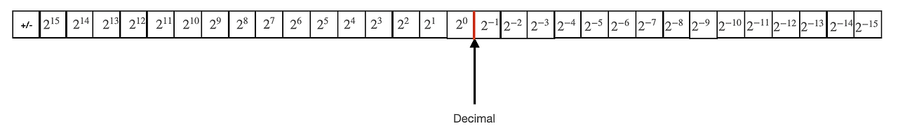

컴퓨터에서 실수를 저장하는 방법에는 고정 소수점과 부동 소수점이 있습니다.

이 글에서는 고정 소수점에 대해 다루겠습니다.

## **고정 소수점**
 

고정 소수점(fixed-point)은 소수 부분의 자릿수를 고정하여 분수(비정수) 숫자를 표현하는 방법입니다.

부호 비트, 정수부, 소수부로 나누어집니다.

고정 소수점에서는 소수 부분이 정수 부분과 동일한 숫자 기반으로 표현되지만, 밑(base) b의 음의 거듭제곱을 사용합니다. 가장 일반적인 변형은 10진법과 2진법입니다. 후자는 일반적으로 이진 스케일링(binary scaling)이라고 합니다.

따라서 n 개의 소수 자릿수가 저장되면 값은 항상 b^-n의 정수 배수가 됩니다.

고정 소수점은 본질적으로 소수부를 고정된 scaling factor로  곱하여 **정수로 표현**하는 것입니다.

예를 들어, 1.23은 변수에 정수 값 1230으로 저장될 수 있으며 이때 scaling factor는 1/1000입니다.

또한 값 1230000의 scaling factor가 1000이면 1230 입니다.

이러한 표현 방식은 표준 정수 연산 유닛을 사용하여 유리수 계산을 수행할 수 있게 합니다.

scaling factor는 내부적으로 정수를 표현하는 데 사용되는 밑(base) b의 거듭제곱(양수 또는 음수)으로 선택됩니다. 그러나 최적의 scaling factor는 어떠한 목적을 가지고 프로그래밍을 하는지에 따라 달라집니다. 따라서 정수가 내부적으로 이진수로 표현될 때에도 인간의 편의를 위해 10의 거듭제곱(예: 화폐단위 변환을 위한 1/100)을 scaling factor로 자주 사용합니다. 10진수 scaling factor는 미터법과 맞아떨어지기 때문에 고정 소수점 scaling factor로 선택되기도 합니다.

또한 다른 scaling factor가 사용될 수 있습니다. 예를 들어, 시간은 초의 정수 값으로 표현될 수 있습니다. 즉, 1/3600의 scaling factor를 가진 고정 소수점으로 표현될 수 있습니다

일반적으로 이진 스케일링으로 연산할 때 scaling factor는 2^소수부의 비트 수입니다.

고정 소수점에서 어떻게 반올림을 하더라고 ± 0.5 \* scaling factor만큼의 오차범위가 생깁니다. 따라서 더 작은 scaling factor는 일반적으로 더 정확한 결과를 산출합니다.

반면에, 더 작은 scaling factor는 주어진 프로그램 변수에 저장할 수 있는 값의 범위가 더 작아짐을 의미합니다. 변수에 저장할 수 있는 최대 고정 소수점 값은 해당 변수에 저장할 수 있는 가장 큰 정수 값에 scaling factor를 곱한 값이며, 최소 값도 마찬가지입니다.

모든 이진 소수 a/2^m (1/16 또는 17/32)는 scaling factor가 1/2^n인 고정 소수점으로 정확하게 표현될 수 있으며, 이때  n≥m입니다. 그러나 대부분의 10진 소수 (예: 0.1 또는 0.123)는 2진법에서 무한 반복 소수이기 때문에 이와 같은 방식으로 표현될 수 없습니다.

## **고정 소수점 변환 예시**
 

예를 들어 12.625를 소수부가 8비트인 16비트 고정소수점으로 변환해 보면

12.625 << 8 == 110010100000이므로 아래와 같이 됩니다.

| 0 | 0 | 0 | 0 | 1 | 1 | 0 | 0 | 1 | 0 | 1 | 0 | 0 | 0 | 0 | 0 |
| --- | --- | --- | --- | --- | --- | --- | --- | --- | --- | --- | --- | --- | --- | --- | --- |

맨 앞에 1비트는 부호 비트이며, 앞에 7비트인 0001100은 12이며, 10100000은 0.625입니다.

## **고정 소수점 장단점**
 

### 장점

1.  **빠른 연산 속도**: 고정 소수점 연산은 부동 소수점 연산보다 더 빠릅니다. 고정 소수점 연산이 단순한 정수 연산으로 처리되기 때문입니다.
2.  **간단한 하드웨어 구현**: 고정 소수점 연산은 정수 연산과 같으므로 저전력 임베디드 시스템이나 복잡한 연산을 할 수 없는 간단한 장치에서 많이 사용됩니다.
3.  **일정한 정밀도**: 고정 소수점 표현은 소수점 이하 자릿수의 정밀도가 일정하게 유지됩니다. 금융 계산처럼 일정한 자릿수의 정밀도가 필요한 경우 유리합니다.
4.  **예측 가능한 계산 결과**: 모든 연산이 정수 연산으로 수행되기 때문에 결과가 예측 가능합니다. 특정 값에서 반올림 오류가 발생하지 않도록 하는 데 도움이 됩니다.
5.  **메모리 효율성**: 고정 소수점 숫자는 부동 소수점 숫자보다 적은 메모리를 사용할 수 있습니다.

### 단점

1.  **제한된 표현 범위**: 고정 소수점 표현은 표현할 수 있는 수의 범위가 제한적입니다. 큰 수나 매우 작은 수를 표현하는 데 부적합할 수 있습니다.
2.  **유연성 부족**: 고정 소수점은 특정 scaling factor에 고정되기 때문에 다양한 크기의 숫자를 처리하는 데 유연성이 부족합니다. 
3.  **오버플로 및 언더플로 위험**: 고정 소수점 연산에서 오버플로(overflow) 및 언더플로(underflow)가 발생할 위험이 큽니다.
