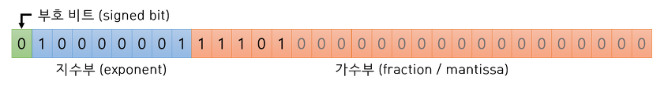
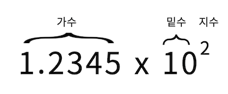

부동 소수점은 고정 소수점과 다르게 소수점의 위치를 고정하지 않고 소수점의 위치를 나타내는 수를 따로 저장하는 방식으로, 유효숫자를 나타내는 가수와 소수점의 위치를 나타내는 지수부로 나누어 표현합니다.



## **정규화**
<br/>

부동 소수점 표현 방식은 수를 (가수) × (밑수)^(지수)와 같이 유효숫자를 사용한 곱셈 형태로 표현합니다.

예를 들어, 123.45를 밑수가 10인 부동 소수점으로 나타내면 12.345 \* 10^1이 되는데, 가수 부분을 한자리 자연수를 갖도록 바꾸면 1.2345 \* 10^2와 같이 됩니다. 이처럼 가수의 첫째 자리가 밑수보다 작은 한자리 자연수가 되도록 바꾸는 것을 정규화라고 합니다.



## **부동 소수점 변환 예시**
<br/>

밑수가 10인 경우에 로마자 E 또는 e를 사용하여 함수 형태로 표시하기도 하는데, -0.4는  -4E-1 또는 -4e-1로 씁니다.

사용할 밑수를 미리 정해 놓는다면 가수와 지수만으로 실수를 표현할 수 있는데, 밑수를 10으로 고정한다면 실수 -0.4는 가수 -4와 지수 -1의 조합으로 나타낼 수 있습니다.

보다 정형화된 형태로는 가수부와 지수부의 자릿수를 고정할 수 있는데, 부호, 가수부 5자리, 지수부 3자리로 하는 형식이라면 앞의 값 -0.4는 '부호 -, 가수 40000, 지수 -005'로 나타낼 수 있습니다.

밑수가 2일 때에 정규화 결과 가수의 첫째 자리는 항상 1이 되므로 생략하면 가수부에 1자리를 더 표시할 수 있게 되므로, 처리할 수 있는 유효숫자가 1자리만큼 늘어납니다. 0.4를 2로 정규화하게 되면 1.6 × 2^-2가 되며, 위의 정형화된 방식으로 표현하면 '부호 +, 가수 60000, 지수 -002'가 됩니다.

## **Bias**
<br/>

지수부에는 따로 부호 비트가 없기 때문에 음수 지수를 처리하기 위해 bias를 사용합니다. 즉, 할당된 비트로 표현 가능한  최댓값을 반으로 나누어, 최댓값의 절반보다 작은 값에는 음수값, 절반과 같은 값에는 0, 절반보다 큰 수에는 양수값이 차례대로 1:1 대응되도록 합니다.

예를 들어, 지수부를 8비트로 표현한다면 모두 256가지 수를 나타낼 수 있는데 이것을 반으로 나누어 -127, 0, 128개를 차례대로 대응시킬 수 있습니다. 따라서, 비트열 00000000은 지수 -127을 나타내고, 01111111 (127)은 지수 0, 11111111 (255)은 지수 128을 나타냅니다.

지수부의 모든 자리가 모두 0 또는 1인 경우는 각각 0 또는 무한대를 나타내는 등 특수한 목적으로 예약되어 있는 경우도 있습니다.

## **정확성**
<br/>

부동 소수점은 고정 소수점과 마찬가지로 0.1, 0.01과 같은 10진 소수를 표현하게 되면 순환 소수가 되기 때문에 정확한 값을 저장할 수 없고, π 와 같은 무리수 또한 정확히 표현할 수 없습니다.

또한 연산에서도 문제가 생깁니다.

교환 법칙은 성립하지만, 결합 법칙, 분배 법칙은 성립하지 않을 때도 있습니다.

나눗셈에서 제수가 0이 아님을 보장할 수 없고, 거의 같은 수를 뺄 때 0이 안되는 경우도 있습니다.

```
#include <iostream>

using namespace std;

int main()
{
    
    double a = 1.1, b = 1.2;

    cout << ((a + a + b) == (a + b + a)) << endl;
    cout << (a + b == b + a) << endl;
    
    return 0;
}

/* 교환 법칙, 결합 법칙 예시
 * 
 * 위에 같은 경우에는 왼쪽 항에서 a + a 부터 연산하고
 * 오른쪽 항에서는 a + b 부터 계산합니다. 
 * 따라서 0을 출력하게 됩니다.
 * 결합 법칙 X
 * 
 * 아래 같은 경우는 1을 출력하게 됩니다
 * 교환 법칙 O
 */
```

따라서 정확한 연산이 필요한 경우, 부동 소수점으로 연산하면 안됩니다.

## **부동 소수점 장단점**
<br/>

### 장점

1.  **넓은 표현 범위**: 부동 소수점 표현은 매우 큰 수와 매우 작은 수를 모두 표현할 수 있습니다.
2.  **정밀도 조절 가능**: 가수부의 자릿수를 조정하여 계산의 정밀도를 조절할 수 있습니다.
3.  **표준화**: IEEE 754 표준에 의해 정의되어 있어, 다양한 시스템과 프로그래밍 언어에서 일관된 방식으로 부동 소수점 을 표현할 수 있습니다..

### 단점

1.  **반올림 오류**: 부동 소수점 연산에서는 반올림 오류가 발생할 수 있습니다.
2.  **정확성**: 모든 연산에서 정확하지 않습니다.
3.  **속도**: 부동 소수점 연산은 정수 연산보다 더 느릴 수 있습니다.
4.  **일관성 부족**: 서로 다른 시스템이나 컴파일러에서 부동 소수점 연산 결과가 약간 다를 수 있습니다.
5.  **메모리 사용**: 부동 소수점 숫자는 정수에 비해 더 많은 메모리를 필요로 합니다. 예를 들어, 단일 정밀도 부동 소수점 숫자는 32비트를 사용하고, 배정밀도 부동 소수점 숫자는 64비트를 사용합니다.
