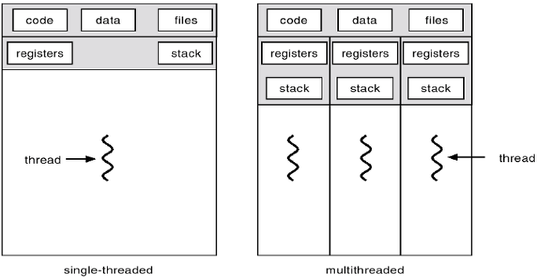

# Java Thread 생명주기

## Thread



역할: **하나의 프로세스 내부**에서 작업을 **수행하는 주체** 

특징:

- Code, Data, Heap 영역을 공유
- Stack, Register는 각 Thread마다 독립적으로 관리됨 
✔️ 이유: Stack과 Register는 **스레드별 실행**에 필요한 데이터를 저장하고 있기 때문
 ▫️Stack - 스레드마다 호출되는 메서드와 그 안의 지역 변수들을 저장
 ▫️Register - CPU 내부에 위치한 초고속 임시 저장소로, 스레드별로 연산에 필요한 중간 데이터나 메모리의 주소등을 각각 관리
    
    
    ⇒ 때문에 Thread 간 교환 (작업 전환) 시 현재 실행중인 스레드의 상태를 저장하고 다른 스레드의 상태로 바꾸는 **컨텍스트 스위칭**은 Stack과 Register를 독립적으로 보관하고 있기 때문에 발생하게 된다.  
    
    - 스레드 간 컨텍스트 스위칭 실습 예제 코드
        
        실행 코드
        
        ```java
        public class Practice {
        
            class ThreadByRunnable implements Runnable {
        
                private final String threadName;
        
                public ThreadByRunnable(String threadName) {
                    this.threadName = threadName;
                }
        
                @Override
                public void run() {
                    for (int i = 0; i < 5; i++) {
                        System.out.println(threadName + " is running, iteration: " + i);
                        try {
                            // 잠시 멈춰서 다른 스레드로 전환 기회를 줌
                            Thread.sleep(100);
                        } catch (InterruptedException e) {
                            Thread.currentThread().interrupt();
                            System.out.println(threadName + " was interrupted.");
                        }
                    }
                    System.out.println(threadName + " has finished execution.");
                }
            }
        
            public static void main(String[] args) {
                Practice practice = new Practice();
        
                Thread thread1 = new Thread(practice.new ThreadByRunnable("Thread 1"));
                Thread thread2 = new Thread(practice.new ThreadByRunnable("Thread 2"));
                Thread thread3 = new Thread(practice.new ThreadByRunnable("Thread 3"));
        
                // 스레드 시작
                thread1.start();
                thread2.start();
                thread3.start();
            }
        }
        	
        ```
        
        결과
        
        ```
        Thread 1 is running, iteration: 0
        Thread 2 is running, iteration: 0
        Thread 3 is running, iteration: 0
        Thread 3 is running, iteration: 1
        Thread 2 is running, iteration: 1
        Thread 1 is running, iteration: 1
        Thread 1 is running, iteration: 2
        Thread 2 is running, iteration: 2
        Thread 3 is running, iteration: 2
        Thread 2 is running, iteration: 3
        Thread 1 is running, iteration: 3
        Thread 3 is running, iteration: 3
        Thread 2 is running, iteration: 4
        Thread 1 is running, iteration: 4
        Thread 3 is running, iteration: 4
        Thread 2 has finished execution.
        Thread 1 has finished execution.
        Thread 3 has finished execution.
        
        Process finished with exit code 0
        ```
        

Java의 Thread 특징: 

- OS Thread와 1대 1로 매핑됨
- JVM에서 OS의 Thread와 매핑을 요청

## Thread의 생명주기


### 1. Thread 객체 생성 - New

- new 키워드를 통해 Thread 객체를 생성
- 아직 start() 메서드를 호출하지 않은 상태

**Thread 객체를 만드는 두가지 방법**

- 1.  Thread 객체를 상속 받아서 구현하는 방식
    
    ```java
    class ThreadExample1 extends Thread {
        @Override
        public void run() {
    			...
        }
    }
    
    ThreadExample1 thread1 = practice.new ThreadExample1();
    ```
    
- 2.  Runnable 인터페이스를 구현하는 방식
    
    ```java
    class ThreadExample2 implements Runnable {
        @Override
        public void run() {
    			...
        }
    }
    
    Thread thread2 = new Thread(practice.new ThreadExample2());
    ```
    

⇒ Java에서는 Runnable 인터페이스 구현 방식을 더 지향

이유: 

- Java는 다중 상속이 불가능하기 때문에 Thread 클래스를 상속 받으면 다른 클래스를 상속받을 수 없다.
- 인터페이스를 사용함으로써 스레드의 동작과, 스레드의 실행 객체를 분리할 수 있어, 코드가 더 유연해진다. → 유연한 설계 및 재사용성을 높일 수 있음
    
    예시)
    
    스레드의 작업을 정의한 Task 클래스 - 동일 run 동작 내용
    
    ```java
    static class Task ~~~~~ {
        private final String taskName;
    
        public Task(String taskName) {
            this.taskName = taskName;
        }
    
        @Override
        public void run() {
            for (int i = 0; i < 5; i++) {
                System.out.println(taskName + " - iteration: " + i);
                try {
                    Thread.sleep(100);
                } catch (InterruptedException e) {
                    e.printStackTrace();
                }
            }
            System.out.println(taskName + " completed.");
        }
    }
    ```
    
    다른 사용 방법
    
    Runnable 인터페이스 구현 시 - 스레드의 작업을 정의한 작업 (Task) 객체를 만들고 이 객체를 할당하고 싶은 Thread 객체 
    
    ```java
    Task task = new Task("Shared Task");
    
    // 같은 작업(Task)을 두 개의 스레드 객체에 전달하여 실행
    Thread thread1 = new Thread(task);
    Thread thread2 = new Thread(task);
    
    // 스레드 실행
    thread1.start();
    thread2.start();
    ```
    
    Thread 상속 시 - 작업 (Task)이 Thread에 종속되기 때문에, 작업 정의와 스레드 실행을 분리할 수 없음  
    
    ```java
    // Thread 객체를 상속한 TaskThread를 두 개 생성
    TaskThread thread1 = new Task("Same Task 1");
    TaskThread thread2 = new Task("Same Task 2");
    
    // 각각의 Thread 객체를 실행
    thread1.start();
    thread2.start();
    ```
    
    ⇒ Runnable 인터페이스로 구현하면 동일 작업을 정의한 Task 객체를 1번만 생성해 놓으면 어느 스레드던지 가져다 쓸 수 있어서 작업 객체 생성과 , 스레드 실행을 분리할 수 있고 재사용성이 높아짐.
        반면 Thread 상속으로 구현 시에는 작업이 스레드에 종속되기 때문에 매번 새로 스레드 생성 시마다 동일 작업임에도 작업을 재정의, 재생성 해줘야 함.
    

### 2. Thread 객체 실행 - Runnable (실행 대기, 실행)

- thread.**start()**를 호출하면 적용되는 상태
- 크게 2가지 메서드, start()와 run()이 이 상태에서 쓰임

 run()

- 현재 실행중인 Thread 내에서 단순히 선언되어 있는 메서드 run()을 호출함으로써 Thread를 실행 상태로 바꿈 (즉, 새로운 스레드를 생성하는 것이 아님)
- **Runnable (실행 대기) 상태** 돌입 시, **현재 실행중인 Thread의 Stack 영역을 차지**해서 실행이 끝날 때까지 **다른 메서드를 호출할 수 없음**.

start()

- 운영체제에 요청하여 **새 Thread를 생성**함
- 이후 JVM scheduling에 의해서 new에서 running 상태로 변경됨

    ⇒ 병렬로 실행하기 위해선, start 메서드를 호출해야 한다.

**Runnable의 두 가지 모습**


1. 실행 대기 상태 → 실행 상태: 
- 실행 대기 상태 - CPU를 할당 받지 않은 상태라서 실행을 하지 않은 상태
- 실행 상태 - 스케줄러에 의해 할당 받게 되면 run 메서드를 실행하게 됨
- CPU의 자원이 한정적이기 때문에 실행 대기 상태의 스레드들은 Ready Queue에서 대기를 하게 되고 할당 후에 실행 (run 메서드 호출) 하게 됨

1. 실행 중 상태 → 실행 대기 상태:  
- 원인: Time Out, yield()
    - Time Out - 각 스레드에 할당된 실행 시간이 모두 지난 경우 대기 상태로 변경
    - yield() (양보) - 현재 실행중인 스레드가 자신에게 할당된 실행 시간을 포기하고 실행 대기 상태로 변경하는 것
        - 사용 상황: 다른 스레드에게 기회를 주고 싶을 때, 자원을 너무 많이 사용하지 않도록 조정할 때

### Thread Blocked 상태

Blocked 상태

- 다른 스레드가 **점유하고 있는 자원에 접근하려고 할 때** 발생하는 상태로, 해당 자원이 **해제될 때까지 대기**하는 상태

예시)

- Syncronized Block
    - 어떤 Thread가 모니터 락을 얻은 자원이나 명시적 락이 걸린 자원에 접근할 경우, 해당 Thread는 락이 해제될 때까지 Blocked 상태로 기다리게 된다.
    - Blocked 상태의 스레드는 CPU가 전혀 활동되지 않으면서, 접근하려는 자원에 락이 해제된다면 다시 Runnable 상태 (실행 대기 상태) 로 돌아가서 CPU의 활동을 기다린다.
    
    ⇒ synchronized를 통해 race condition을 막을 수 있다.
    

Waiting 상태

- 목적: 스레드의 동기화를 위해 필요함
- Blocked 와의 차이점: Blocked는 접근을 시도하는 스레드가 대기하는 상태(자원 잠금과 관련되 대기)이지만, Waiting은 Syncronized 블록 안에 있는 코드를 실행하는 스레드를 대기시키는 형태로, waiting은 특정 조건이 충족될 때까지 **명시적으로 대기**하는 상태를 의미한다.

    ⇒ CPU 자원을 사용하지 않고 특정 조건이 발생할 때까지 무기한 대기하는 것 

- 이때 사용하는 메서드가 wait()이다. wait()이 호출된 Thread는 락을 해제하고 대기한다. notify나 notifyAll 메서드가 호출되어야 waiting 상태로 대기하던 Thread가 Runnable로 바뀌게 된다.
- 따라서, `Waiting` 상태는 `synchronized` 블록 안에서 일시적으로 자원을 해제하고 대기하므로 **다른 스레드가 그 자원에 접근할 수 있는 상태**를 만들어준다.

### Waiting vs Blocked 예시

syncronized로 Blocked 상태를 만든 경우

공유 자원

```java
class SharedResource {
  public synchronized void accessResource() {
    System.out.println(Thread.currentThread().getName() + " is accessing the resource.");
    try {
        Thread.sleep(2000); // 자원을 사용하는 동안 잠시 멈춤
    } catch (InterruptedException e) {
        e.printStackTrace();
    }
    System.out.println(Thread.currentThread().getName() + " has finished using the resource.");
  }
}
```

실행문

```java
public class Practice {

  public static void main(String[] args) {
    SharedResource resource = new SharedResource();

    // Runnable 인터페이스 구현
    Runnable task = () -> {
        resource.accessResource();
    };

    Thread thread1 = new Thread(task, "Thread 1");
    Thread thread2 = new Thread(task, "Thread 2");

    thread1.start();
    thread2.start();
  }
}
```

실행 결과

syncronized가 안 붙은 경우 - 스레드 점유 및 타 스레드 대기 발생 X

```java
Thread 1 is accessing the resource.
Thread 2 is accessing the resource.
Thread 2 has finished using the resource.
Thread 1 has finished using the resource.
```

syncronized가 붙은 경우 - 스레드 점유 및 타 스레드 대기 발생 O

```java
Thread 1 is accessing the resource.
Thread 1 has finished using the resource.
Thread 2 is accessing the resource.
Thread 2 has finished using the resource.
```

쓰이는 상황 ex. VIP 고객 우선 예약권 부여시 

waiting 사용 경우

각 waitingThread와 notifyingThread는 waitForCondition과 reachCondition 메서드를 구현한 Runnable 인터페이스를 task로 받음

예시)

```java
class WaitingExample {
    private boolean conditionSet = false;

    public synchronized void waitForCondition() {
        while (!conditionSet) {
            try {
                System.out.println(Thread.currentThread().getName() + " is waiting.");
                wait(); // 잠금을 해제하고 Waiting 상태로 들어감
            } catch (InterruptedException e) {
                e.printStackTrace();
            }
        }
        System.out.println(Thread.currentThread().getName() + " resumed after condition set.");
    }

    public synchronized void reachCondition() {
        conditionSet = true;
        System.out.println(Thread.currentThread().getName() + " is notifying waiting thread.");
        notify(); // Waiting 상태에 있는 스레드를 깨움
    }
}
```

실행문

```java
public class Practice {

    public static void main(String[] args) {
        WaitingExample example = new WaitingExample();

        Thread waitingThread = new Thread(example::waitForCondition, "WaitingThread");
        Thread notifyingThread = new Thread(example::reachCondition, "NotifyingThread");

        waitingThread.start();
        try {
            Thread.sleep(1000);
        } catch (InterruptedException e) {
            e.printStackTrace();
        }
        notifyingThread.start();
    }

}
```

실행 결과

```java
WaitingThread is waiting.
NotifyingThread is notifying waiting thread.
WaitingThread resumed after condition set.
```

실행 상황 ex. 생산자와 소비자의 경우 - 주문 요청 없을 경우 

### TIMED_WAITING

- sleep 메소드로 인해 변경되는 상태
- sleep하는 시간이 지나면 다시 runnable 상태가 됨

### TERMINATED

- run() 메서드 종료
- main Thread 종료
- interupt()로 도달할 수 있는 상태
- 이미 종료된 Thread는 재실행할 수 없다.

### Thread 사용 시 주의 사항

- 과도한 컨텍스트 스위칭
- Race Condition
- DeadLock, Starvation
