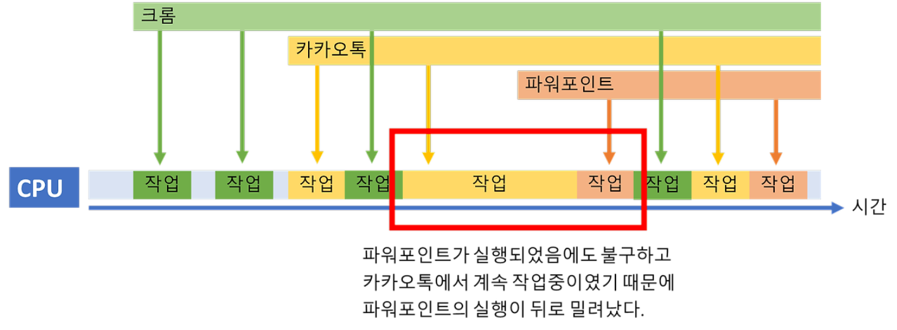
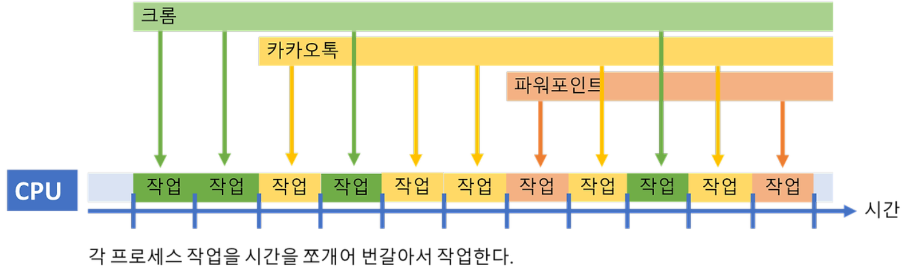
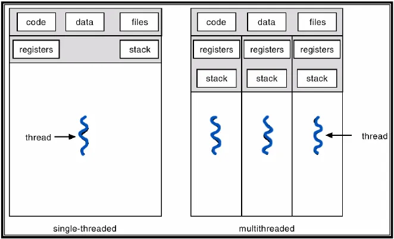

# 스레드와 프로세스

### 프로세스

의미

- **CPU** 스케줄링의 대상이 되는 작업(task), 컴퓨터에서 **실행 중**인 **프로그램**
    - CPU(**프로세서**) : 명령어를 실행하는 연산 장치
        - **프로세서** - 프로세스가 실제 **동작**을 할 수 있도록 하는 하드웨어(=cpu)
    - **프로그램** - 컴퓨터가 실행할 수 있는 명령어 들의 집합 (실행을 해야만 하는, 코드로 구현되어 있는 파일)
        - ex. 윈도우에서 .exe 확장자를 갖는 파일들

  ✔️ **프로그램 vs 프로세스** : 프로그램이 메모리에 올라가면 프로세스가 되는 것이다.

프로그램이 프로세스가 되면서 발생하는 일

1. 프로세스가 필요로 하는 재료들이 **메모리**에 올라가게 된다.
    1. **메모리** : 프로세스가 CPU에서 실행되기 위해 대기하는 곳으로 코드, 힙, 데이터, 스택로 구성
2. 해당 프로세스에 대한 정보를 담고 있는 **PCB(Process Control Block)** 블럭이 프로세스 생성 시 만들어진다.
    1. **PCB(Process Control Block)** : 프로세스 식별자(ID), 현재 프로세스의 상태 정보(ex. 준비, 대기), 프로그램 카운터(다음 실행할 명령어의 주소), 포인터(ex. 부모 프로세스 포인터, 자식 프로세스 포인터, 프로세스가 위치한 메모리 주소에 대한 포인터 등)
    2. 🟠 PCB는 프로세스 내부에 생성되지 않고 운영체제가 관리하는 특정 영역에 저장이 되는데, 그 이유는 PCB는 운영체제가 프로세스를 관리하고 스케줄링 하는데 필요한 정보를담고 있어 운영체제의 데이터 구조로 관리하는 것이 편리하기 때문이다. 예를 들어 컨텍스트 스위칭 상황을 예로 들 수 있다. (커널 공간과 같이 운영체제가 신속하게 접근할 수 있는 공간에서 관리한다.)

작업의 흐름

- 코드, 데이터, 스택, 힙 메모리 (RAM) 영역에 로드된다.
    - 코드 - 프로그램의 코드
    - 데이터 - 전역변수 (static, global 변수)
    - 스택 - 동적 영역, 컴파일 시에 크기 결정됨. (호출된 함수, 지역 변수 등의 임시 데이터)
    - 힙 - 동적 할당, 런타임 시에 크기 결정됨. (객체 데이터)
- CPU 스케줄러에 의해 CPU를 할당 받고 동작하게 된다.

  ✔️ **CPU(프로세서)**는 **한순간에 하나의 프로세스**만 실행할 수 있다.

    - 때문에 운영체제는 이를 시분할로 짧은 텀을 두고 여러 개의 프로세스를 **교체**하면서 마치 여러 개의 작업이 실행되고 있게, 즉 멀티 테스킹을 하는 것과 같은 느낌을 느끼게 해준다.
        - **교체** - **컨텍스트 스위칭**
- **통신** : 프로세스는 다른 프로세스와 통신하기 위해 **IPC**를 사용한다.
    - **IPC(Inter Process Communication)** : 프로세스 간 통신을 가능하게 하는 기법
        - 종류 : 공유 메모리, 파이프, 소켓, 메시지 큐, 메모리 맵, RPC(Remote Procedure Call)

### 스레드

의미

- 프로세스 내 실행 가능한 작업의 흐름(독립적인 실행 흐름), 가장 작은 단위

  한 프로세스 (한 프로그램 ex. 하나의 브라우저에서도) 내에서도 데이터 다운 로드, 음악 재생, 영상 재생 등 다양한 일을 할 수 있다. → 이 프로세스 내에서 여러개의 각 작업들을 **스레드**라고 한다.

특징

- 자원 소모적인 프로세스의 단점을 보완하기 위해 나옴

  ✔️ 공유 자원 존재 : 프로세스 내의 스택 메모리 영역을 제외한 다른 메모리 영역을 프로세스 내 다른 스레드들과 공유한다.

    - 스택은 함수 호출 등의 정보를 저장하기 때문에 각 스레드 별 독립적으로 함수 호출 상태를 유지할 수 있도록 한다.
    - 힙, 코드, 데이터는 주로 모든 스레드가 공유할 수 있는 자원들이 들어가 있다.

✔️  메모리를 공유함으로써 얻을 수 있는 장점 :

- 다른 스레드들과의 정보 공유가 쉬워 효율성이 좋다.
- 컨텍스트 스위칭 비용이 절감된다.  (데이터를 다 빼고 처음부터 다시 넣을 필요가 없다.)
- 동일 데이터에 접근하기 때문에 컨텍스트 스위칭 시 캐싱 적중률이 올라가게 된다.

✔️ 단점 : 멀티 스레드 환경일 경우 한 스레드의 문제가 다른 스레드에도 영향을 끼칠 수 있어 경쟁 상태, 데드락 등의 문제가 존재한다.

### 프로세스 vs 스레드 정리

|  | 프로세스 | 스레드 |
| --- | --- | --- |
| 의미 | 운영체제로부터 자원을 할당 받는 작업의 단위 | 프로세스가 할당 받은 자원을 이용하는 실행의 단위 |
|  |  |  |

### 멀티 프로그래밍

등장 배경 : 단일 프로세스의 CPU 사용률 비효율성

→ IO 작업이 들어오면 CPU는 작업을 중단하고 아무것도 안하고 있음. CPU가 아무것도 안하는 시간 존재.

- 여러 개의 프로그램이 동시에 실행된다.
- CPU 사용률을 극대화 시키는데 목적을 둔다.
- 단점 : CPU 사용 시간이 길어지면 다른 프로세스는 계속 대기 해야 한다.
- → 해결책 : 프로세스는 한 번 CPU를 사용할때 아주 짧은 시간(=quantum)만 CPU에서 실행되도록 하자. (멀티 태스킹의 등장 배경)

### 멀티 태스킹

- 프로세스 또는 스레드 여러개를 실행 하되, **아주 짧은 시간 동안 번갈아가면서 실행**시켜 마치 동시에 실행하는 것처럼 보이게 한다. ➡️ **멀티 프로세스와 멀티 스레드의 공통점**
- 프로세스의 응답 시간을 최소화 시키는데 목적을 둔다.
- 멀티 프로세스와 멀티 스레드를 포함하는 개념, 그러나 구현 방식과 적용 사례에는 차이가 있다.
- 단점 : 컨텍스트 스위칭 오버헤드

### 멀티 프로세스 vs 멀티 스레드

: 둘 다 (한 어플리케이션에 대한) 서로 다른 처리 방식

한 어플리케이션이 여러 가지 일을 처리해야 하는 상황 ex. 여러 사용자의 로그인 요청

**멀티 프로세스** :

- 프로세스 각각은 별개의 메모리 영역을 확보하게 된다. **독립적**
- 예시) chrome - 멀티 태스킹(멀티 프로세스) 방식으로 한 프로세스의 문제가 발생해도 다른 프로세스에 전달되지 않는다.

❓ 프로세스 간에는 공유하는 것이 아예 없는 것인가?

❓ 멀티 프로세스 방식에서는 동기화 문제가 아예 발생하지 않는가? → ❌

➡️ 프로세스 간에는 **메모리**를 기본적으로 공유하지 않는다. 그러나 **다른 형태의(외부) 자원은 공유할 수 있다.**

예시)

- **파일 디스크립터(File Descriptors)**

  웹 서버 운영 시, 여러 사용자의 요청을 처리하기 위해 여러 프로세스를 사용하게 된다. 이때 모든 프로세스가 같은 로그 파일에 접근해 기록을 남겨야 할 경우, 여러 프로세스가 동시에 파일 디스크립터라는 핸들 도구에 접근하게 된다. 이 경우, 이 도구를 동시에 접근하는 것을 방지하기 위한 동기화 작업이 필요하게 된다.

- **네트워크 소캣(Network Sockets)**

  채팅 애플리케이션 개발 시, 여러 사용자의 메시지를 처리하기 위해 여러 프로세스를 사용하게 된다. 모든 사용자가 같은 서버에 접속하여 메시지를 주고 받을 때, 이 서버는 하나의 네트워크 소켓을 통해 여러 사용자로부터 데이터를 받게 된다. 때문에 이 네트워크 소캣은 여러 프로세스가 공유하며, 각기 다른 사용자로부터 도착하는 메시지를 처리할 수 있어야 한다.

➡️ 멀티 프로세스 모델에서는 외부 자원(예: 파일 디스크립터, 네트워크 소켓)과 관련된 동기화 문제는 발생할 수 있지만, 각 프로세스가 독립적으로 실행되고 메모리를 공유하지 않기 때문에, **프로세스 간의 결합도**가 상대적으로 낮다.

장점

1. 안정성 및 격리 - 프로세스가 독립적인 메모리 공간을 갖기 때문에, 하나의 프로세스에서 오류가 발생하더라도 다른 프로세스에 영향을 미치지 않는다.
2. 보안 - 격리된 메모리 공간을 사용하기 때문에, 프로세스 간의 데이터를 임의로 접근할 수 없으며, 의도적으로 데이터를 공유하려면 명시적인 IPC 메커니즘을 사용해야 한다.
3. 운영체제의 지원 - 멀티 스레드에 비해 멀티 프로세스의 구조를 더 잘 지원한다. 프로세스 간의 자원 분배, 우선순위 관리, 자원 사용량 등 운영체제 차원에서 더 세밀하게 관리할 수 있다.

단점

1. 개별 메모리를 차지함으로 자원 소모적이다.
2. 다른 프로세스의 정보를 이용하기 위해서 별도의 통신이 필요하다. **IPC**
- 컨텍스트 스위칭 비용이 크다. (프로세스의 컨텍스트 스위칭은 무겁다.)

멀티 스레드 :

- 하나의 프로세스가 동시에 여러 작업을 실행하는데에 목적을 둔다.
- 한 프로세스 내에서 구분지어진 실행 단위로 스택을 제외한 나머지 데이터들의 메모리는 공유한다. ex. 인텔리제이에서 서버를 띄우고 코드는 수정하고 .. 즉 한 어플리케이션에 대한 작업의 단위가 나누어지는 경우
- 동시성 : 서로 독립적인 작업들을 작은 단위로 나누고 동시에 실행되는 것처럼 보여주는 것
    - 적절한 동기화 처리가 된 상태에서, 하나의 스레드가 실패해도 나머지 스레드는 제대로 동작할 수 있다.

  예) 웹 요청을 처리할 때 새 프로세스를 생성하는 대신 스레드를 사용하는 웹서버의 경우 훨씬 적은 리소스를 소비하며 한 스레드가 중단(blocked)되어도 다른 스레드는 실행(running) 상태일 수 있기 때문에 중단되지 않는 빠른 처리가 가능하다.

- 공유 자원으로 통신 비용이 절감 되고 메모리를 효율적으로 사용할 수 있다.
- 컨텍스트 스위칭 비용 절감 (코드, 힙, 데이터 영역을 교체할 필요가 없기 때문)
- 여러 스레드가 공유 자원에 동시에 접근하는 문제를 방지하기 위해 동기화를 신경 써야 한다. → **뮤텍스, 세마포어**
- 예시 ) Internet Explorer - 멀티 스레드 사용으로 띄운 여러 화면 중 하나에서 문제가 생기면 인터넷 익스플로어 전체가 종료된다

### 면접 대비 질문 체크

✔️ 프로세스의 구조에 대해 설명하기

✔️ 컨텍스트 스위칭에 대해 설명하기

✔️ 프로세스 간의 통신, 스레드 간의 통신에 대해 설명하기

✔️ 프로세스와 스레드의 차이점

✔️ 멀티 프로세스와 멀티 스레드의 차이점

✔️ 스레드 동기화에 대해 설명하기 → 뮤텍스와 세마포어

✔️ 멀티 테스킹에 대해 설명하기