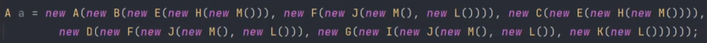

# Spring

Created: 2024년 9월 24일 오전 1:12
Type: Note
Category: Spring

**Description:**

## Spring의 핵심 개념: IoC와 DI를 통한 Bean 관리

### Spring Framework

Spring Framework는 Java 기반의 엔터프라이즈 애플리케이션 개발을 위한 경량 프레임워크로,  의존성 주입(DI), AOP(Aspect-Oriented Programming), 트랜잭션 관리, MVC 패턴 등을 지원하여 애플리케이션 개발을 쉽게 만듭니다. 

- 엔터프라이즈 : 대규모 비즈니스를 위한 애플리케이션
- 프레임워크란 무엇인가요?
    - 프레임워크는 SW 개발 시 일정한 구조와 기능을 제공하는, 재사용 가능한 코드 기반입니다. 개발자는 이 구조를 활용하여 빠르게 애플리케이션을 구축할 수 있습니다.

### Spring DI와 IoC

### IoC (Inversion of Control) : 제어의 역전

- 제어
    - new 키워드를 사용하여 `클래스 내에서 직접` 객체를 생성하는 것  ⇒ 객체의 생명 주기를 직접 제어(관리)하는 코드
        
        ```java
        // A 클래스에서 B 클래스를 필드로 가지고 있고 생성자 내부에서 직접 B를 생성해 필드를 초기화하고 있다.
        public class A {
        	private B b;
        	
        	public A() {
        		this.b = new B();
        	}
        }
        ```
        

- 역전
    - 프로그램 제어 흐름을 직접 제어하는 것이 아니라 `외부에서` 제어(관리)하는 것 ⇒ 제어를 역전시켰다!
        
        ```java
        // 외부로부터 클래스 B를 인자로 받아 초기화하고 있다.
        public class A {
        	private B b;
        	
        	public A (B b) {
        		this.b = b;
        	}
        }
        ```
        

### 제어의 역전 : IoC가 필요한 이유

예시) 샌드위치를 주문하는 상황에서 속 재료 변경 (핫소스 변경)을 손님 요청한 상황

- 객체 내에서 제어를 하는 경우 → 객체 내에서 클래스를 생성(`new` 키워드)하고 있기 때문에 이미 지정된 재료(클래스)들로만 만들 수 있어 요청을 들어줄 수 없다.
    
    ```java
    public class BeefSandWitch {
    	WhiteBread whiteBread;
    	MozzarellaCheese mozzarellaCheese;
    	HotSauce hotSaouce;
    	AmericanBeef americanBeef;
    	
    	public BeefSandWitch() {
    		// 각 재료들에 대한 제어권이 객체 내부에 위치한다.
    		this.whiteBread = new WhiteBread();
    		this.mozzarellaCheese = new MozzarellaCheese();
    		this.hotSaouce = new HotSaouce();
    		this.americanBeef = new AmericanBeef();
    	}
    }
    ```
    

- 제어의 역전 (외부에서 제어)를 하는 경우 → 외부에서 인터페이스 형태로 받아서 어떤 종류의 빵, 치즈, 소스들을 받을 수 있게 된다.
    - 주문(BeefSandWitch)에 대한 제어권을 기존 BeefSandWitch에서 주문하는 손님(개발자)로 이동하게 된다!
    
    ```java
    public class BeefSandWitch {
    	Bread bread;
    	Cheese cheese;
    	List<Sauce> sauces;
    	
    	public BeefSandWitch(Bread bread, Cheese cheese, List<Sauce> sauces) {
    		// 외부에서 재료 선택의 제어권을 갖는다. 
    		this.bread = bread;
    		this.cheese = cheese;
    		this.sauces = sauces;
    	}
    }
    ```
    

- IoC가 필요한 이유 : “역할과 책임 분리”라는 객체지향의 원칙을 잘 지키기 위함
    - 역할과 책임을 분리함으로써 객체의 응집도를 높이고 객체 간의 결합도는 낮추며 변경에 유연한 코드로 만들 수 있다.
    - Hollywood Principle “Don’t call us, we’ll call you” : 주도권을 외부에 넘기고 호출되기만을 기다른 모습이 IoC와 유사함
    

### DIP (Dependency Inversion Principle) : 의존 역전 원칙

- 의미 : 상위 레벨의 모듈은 절대 하위 레벨 모듈에 의존하지 않는다. 둘 다 `추상화`에 의존해야 한다.
- 예시)
    - 상위(고수준) 모듈 : BeefSandWitch 클래스
    - 하위(저수준) 모듈 : WhiteBread 클래스
- 기존 방식의 경우 빵 종류 변경을 요청하면 WhiteBread 클래스도 변경이 필요함. (BeefSandWitch  → WhiteBread 로 영향이 연쇄 반영된다.)
    
    ✔️ 이 경우 DIP를 이용하여 추상화로 해결할 수 있다. (즉 BeefSandWitch → Bread 의존을 바꾼다.) 
    
- DIP를 적용한 방식의 경우 빵을 Bread라는 `Interface`로 변경하여 빵의 종류에 제약 받지 않게, 고수준 모듈인 BeefSandWitch 클래스가 저수준 모듈인 WhiteBread에 의존하지 않게 바꿔준다.
    - WhiteBread는 Interface인 Bread만 보고 있기 때문
    
    ⇒ **고수준 모듈과 저수준 모듈이 모두 Bread라는 추상화된 인터페이스에만 의존하게 바꿔주었다. → DIP**
    

➡️ IoC와 DIP의 목적 

- 클래스 간의 결합을 느슨히하여 한 클래스의 변경에 따른 다른 클래스들의 영향을 최소화 하기 위함이다. (객체 내 응집도 높이고, 객체 간의 결합도는 낮추고)
- 이를 통해 지속 가능하고 확장성 있는 애플리케이션을 만들 수 있게 된다.

✅ 정리

- IoC와 DIP의 공통점 : 둘 다 원칙에 해당된다.
- 차이점
    - IoC : 제어의 주도권을 역전 시킨 것
        
        ```java
        public class BeefSandWitch {
        	WhiteBread whiteBread;
        	MozzarellaCheese mozzarellaCheese;
        	HotSauce hotSaouce;
        	AmericanBeef americanBeef;
        	
        	public BeefSandWitch(WhiteBread whiteBread, MozzarellaCheese mozzarellaCheese, HotSaouce hotSaouce, AmericanBeef americanBeef) {
        		// 각 재료들에 대한 제어권이 객체 내부에 위치한다.
        		this.whiteBread = whiteBread;
        		this.mozzarellaCheese = mozzarellaCheese;
        		this.hotSaouce = hotSaouce;
        		this.americanBeef = americanBeef;
        	}
        }
        ```
        
    - DIP : IoC를 달성하는 디자인 패턴 중 하나로, 모듈 간 의존하는 방향을 역전 시킨 것 (필드가 인터페이스로 구현되어 있음!)
        - 고수준 모듈, 저수준 모듈이 모두 추상화에 의존하게 되면서 의존 방향이 역전되게 되었다.
        
        ```java
        public class BeefSandWitch {
        	Bread bread;
        	Cheese cheese;
        	List<Sauce> sauces;
        	
        	public BeefSandWitch(Bread bread, Cheese cheese, List<Sauce> sauces) {
        		// 외부에서 재료 선택의 제어권을 갖는다. 
        		this.bread = bread;
        		this.cheese = cheese;
        		this.sauces = sauces;
        	}
        }
        ```
        

### IoC를 구현하는 방법 중 하나 : DI ( Dependency Injection )

의존성 주입 방법 3가지 

1. 생성자 주입 (제일 권장됨)
    - 위의 예시와 동일
2. Setter 주입
    
    ```java
    public class BeefSandWitch {
    	WhiteBread whiteBread;
    	MozzarellaCheese mozzarellaCheese;
    	HotSauce hotSaouce;
    	AmericanBeef americanBeef;
    	
    	public setWhiteBread(WhiteBread whiteBread) {
    		this.whiteBread = whiteBread;
    	}
    	
    	// 나저미 같은 맥락으로 구성됨
    	// ...
    }
    ```
    
3. Interface 주입

### Spring에서의 DI 활용

활용 예시)

- @Bean을 이용한 주입만 하고 있음.
- Spring Bean으로 등록되면 스프링이 자동으로 생성해주며, 이 때 필요한 의존성도 자동으로 주입해준다.

```java
@RestController
public class MemberController {

    private final MemberServiceImpl memberService;
    
    @Autowired
    public MemberController(MemberServiceImpl memberService) {
        this.memberService = memberService;
    }
}
```

```java
@Service
public class MemberServiceImpl implements MemberService {
}
```

### 의존성 주입 방법

@Autowired 어노테이션 붙이기 - 스프링이 자동으로 의존성을 주입해준다.

1. 다만 주입 대상도 Spring Bean으로 등록되어 있어야 한다. 
- Autowired를 통한 의존성 주입 방법 3가지
    1. 필드 주입 (추천되지 않음) 
        1. 원래는 불가능한 주입을 프레임워크의 힘을 빌려 주입을 자동으로 가능하게 한 것 
        2. 추천하지 않는 이유 : 필드 주입을 사용하게 되면 테스트 시 자동이 아닌 수동으로 의존성 주입을 못하기 때문이다. 그래서 이 방식은 프레임워크에 강하게 종속된다는 문제점을 갖고 있다. 
    2. Setter 주입 
    3. 생성자 주입 (추천)
        1. 객체의 최초 생성 시점에 스프링이 의존성을 주입해준다. 
        2. 추천 이유 : 생성자로 주입된 컴포넌트들은 완전히 초기화된 상태로 클라이언트에 반환되기 때문이다. 
        3. 주입 특징 : 
            1. 필드를 final로 만들어줘야 하고 초기화 과정이 생성자 호출 시 최초 1회만 이루어지게 된다.  이를 통해 의존 관계를 불변으로 만들어 줄 수 있다. 
            2. final로 인해 NullPointException을 방지해 줄 수 있다. (new 키워드로 생성 시에는 위 에러 발생 위험이 존재) 
            3. 순환 참조를 방지할 수 있다. 

## Spring Bean이란?

Spring IoC 컨테이너가 관리하는 객체 

Q1. Spring Bean이 필요한 이유

의존성을 우리가 직접 생성하는 방식으로 가져갈 경우, 의존성 수가 늘어남에 따라 관리가 어려워 지게 된다. 예를 들어 A라는 메서드를 생성하기 위해 연관된 모든 객체들을 다 미리 생성해줘야 한다. 아래 사진처럼 사용되는 모든 객체를 파악해야 하고 많은 객체가 중복 생성되게 된다. 



따라서 스프링 IoC에서 의존성 주입이 필요한 객체를 빈으로 등록해서 사용하게 해준다. 이렇게 하면 우리는 사용하는 것에만 집중할 수 있게 된다. 

- IoC와 DIP의 목적
    - 클래스 간의 결합을 느슨히 하기 위함 ( 한 클래스의 변경에 따른 다른 클래스들의 영향을 최소화하는 것 )
    - 공통점 : 둘 다 원칙에 포함된다.
    - 차이점
        - IoC - 제어의 역전
            - 필드에 대한 제어권이 있었음 , 외부의 미지의 존재에게 제어권이 넘어가 어떤 객체, 재료가 들어오는지 알 수 없다.
        - DIP - 의존 방향의 역전
            - 이미 구체적인 클래스로 구현되어 변경이 자유롭지 못했던 IoC 코드에서 필드를 인터페이스로 작성하여 상속받은 모든 종류의 재료들이 들어올 수 있어 변경에 자유로워진 것을 알 수 있다. 또한 고수준 모듈 입장에서 만들어진 인터페이스에 저수준 모듈이 의존을 하게 되었다.
        - 즉, DIP는 고수준 모듈, 저수준 모듈이 모두 추상화에 의존하게 되며, 의존 방향이 역전된 것이다.

- 빈은 싱글턴으로 관리된다. (단점 2개)싱글톤 패턴은 다형성을 이용하지 못한다. 이유는 싱글톤 사용시 생성자의 접근제어자를 private으로 설정해야 한다. 이렇게 되면 해당 객체는 상속이 불가능하다. 또한 단위 테스트가 어렵다.
    - 위 단점들을 스프링 IoC 컨테이너가 해결해준다. 먼저 스프링 IoC 컨테이너가 생성이 되면 빈 스코프가 싱글톤인 객체를 생성한다. 이때 빈으로 등록하기 위해서 우리는 어노테이션 기반 혹은 Java 설정 클래스 기반 혹은 xml 기반의 당야한 Configuration 메타데이터를 이용하여 통일된 Bean Definition을 생성한다. 그리고 빈으로 등록할 POJP와 Bean Definition을 이용하여 빈을 생성한다. 이 과정에서 싱글톤 패턴을 사용하는 것이 아닌 평범한 자바 클래스를 이용하여 객체를 생성한다.
    - IoC 컨테이너는 싱글톤 레지스트리라는 기능도 가지고 있다. 레지스트리는 Spring 뿐만 아니라 CS에서 전반적으로 쓰이는 개념으로 Key와 Value 형태로 데이터를 저장하는 방법이다. Spring IoC 컨테이너는 빈 스코프가 싱글톤인 객체에 빈의 이름을 Key로 객체를 value로 저장한다. 그래서 의존성이 주입 되어야 하는 객체가 빈으로 등록되어 있을 때 스프링은 빈의 이름을 이용하여 항상 동일한 Single Object을 반환하게 된다.
        
        
        
        이렇게 빈 객체가 생성이 되면 IoC 컨테이너는 의존 설정을 하게 된다.  이때 의존성 자동 주입이 일어나게 된다. 그리고 객체를 초기화 하는 과정을 진행하게 된다. 커넥션 풀처럼 사용 전에 초기화 과정이 필요한 객체들은 초기화 과정을 진행한다. 이후 사용을 하다가 스프링 컨테이너가 종료될 때 빈 스코프가 싱글톤인 객체들도 함께 소멸되게 된다. 
        
    - 빈 설정 시 주의점 :
        - Thread 간 객체를 공유하게 되면 데이터의 일관성을 유지할 수 없기 때문에 빈 스코프를 싱글톤으로 설정할 경우 상태를 가지면 안된다. 하지만 우리는 상태를 갖는 빈을 생성할 수도 있다. 왜냐하면 빈은 생성되고 존재하고 적용되는 범위를 지정할 수 있기 때문이다. (빈스코프) 빈을 적용하는 객체에 Scope 어노테이션을 사용하여 설정할 수 있다. 예 @Scope(”prototype”) 으로 설정해주면 요청이 올때마다 객체가 생성이 된다. 이는 모든 스레드에서 공유하는 것이 아니므로 해당 객체는 상태를 가질 수 있게 된다.
        - 또한 의존성을 자동 주입해야 할 인터페이스에 구현체가 두 개 이상이라면 스프링은 어떤 구현체를 자동 주입할지 정하지 못해서 충돌이 일어나게 된다. 이는 어노테이션을 활용하여 우선순위를 부여하여 해결할 수 있다. (@Primary, @Qualifier로 이름 명시)

## ..


    
    의존성 주입 (DI)은 객체 간의 의존성을 Spring 컨테이너가 관리하여 주입하는 디자인 패턴입니다. 객체가 직접 의존성을 생성하는 것이 아니라, 외부에서 주입 받아, 객체 간 결합도를 줄이고 테스트 및 유지보수를 용이하게 만듭니다. 주입 방식에는 생성자 주입, 세터 주입, 필드 주입이 있습니다. 
    
    DI는 Inversion of Control라고도 하며, 어떤 객체가 사용하는 의존 객체를 new 선언을 통해 클래스 내부에서 직접 만드는 게 아니라, 외부에서 주입 받아서 사용하는 방법을 말합니다. 
    
    스프링의 IoC 컨테이너틑 애플리케이션 컴포넌트의 중앙 저장
    
    스프링 IoC 컨테이너 안에 들어있는, 관리하 객체들을 빈(Bean)이라고 합니다. 우리는 이 빈들을 설정 소스로부터 빈 정의를 읽어들이고, 빈을 구성하고 사용하게 됩니다. BeanFactory는 스프링 IoC 컨테이너의 가장 최상위 단에 있습니다. 이 BeanFactory가 IoC의 핵심이 된다. 
    
    스프링 초기에는 이러한 빈을 xml로 설정하는 것이 대세였지만 이후 어노테이션 기반의 DI을 사용하게 되었다. 
    
    빈의 종류에는 @Service, @Repository 등이 있는데, 이들이 빈으로 사용되는 이유(IoC 컨테이너가 관리하는 이)는 의존성 주입을 받기 위해서 이다. 또한 빈의 scope 때문이기도 하다. 즉 애플리케이션 서버 내에서 해당 서비스와 레포지토리는 오직 하나만 이용이 돼도 무방하다. 이렇게 싱글톤으로 관리가 가능할 때 IoC 컨테이너를 사용하면 편리하다. 
    
    또한 빈은 라이프 사이클 인터페이스를 지원해준다. 이를 통해 부가적인 작업들을 할 수 있다. 
    
    의존성이 많으면 메서드별로 단위테스트를 수행하기 어렵다. 특히나 의존성을 직접 만드는 경우 더 어렵다. 때문에 의존성을 주입 받는 방식으로 더 효율적으로 운영한다. 이유는 의존성을 주입 받으면 우리가 가짜 객체를 만들어서 테스트를 수행할 수 있어 , 의존성을 끊어낼 수 있기 때문이다. 
    
    다음으로 스프링 IoC 컨테이너에서 가장 많이 사용하게 될 빈 팩토리는 ApplicationContext가 있다. 이 친구는 BeanFactory를 상속받으면서도 추가적으로 ApplicationPublisher 등의 기능을 가지고 있다. ApplicationContext 인터페이스는 Spring IoC 컨테이너를 대표하고 이 빈들을 인스턴스화, 구조화, 조립화 하는 것에 대한 책임을 갖는다. 
    
    - Spring 컨테이너의 동작 순서와 관리 방법은?
    - 싱글톤이란? 애플리케이션 실행 내에 하나의 객체만을 생성해서 쓰는 방식이다. 하나의 객체만 사용하기 때문에 런타임 시 성능 최적화와 메모리 사용에 효율적이다.
    - 싱글톤이 아닌 건 프로토타입이라는 게 있다. 프로토타입은 싱글톤과 달리 매번 다른 객체를 사용한다.
-
